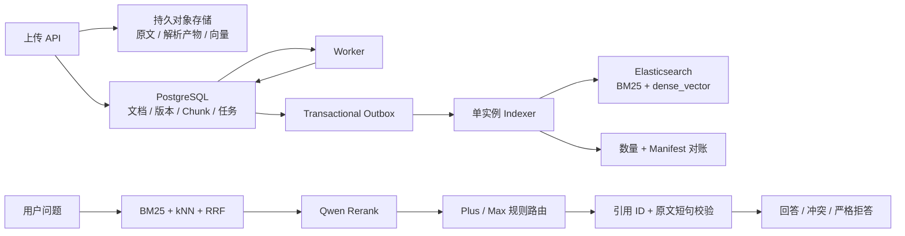

# PostgreSQL + Elasticsearch 知识库实施与在线回测报告

## 1. 验收结论

2026-08-13 已完成 PostgreSQL 事实库、持久对象存储、Elasticsearch 9.4.3 混合检索、
Qwen 持久向量、可靠增量索引、版本治理、证据约束回答和最小 Web 页面的实现与回测。

当前合成基准全部达到设计门槛：

- 1000 份中英混合文档解析为 2550 个知识块，真实 Qwen Embedding 全量成功。
- 230 题真实 BM25 + filtered kNN + RRF + Qwen Rerank 回测通过；Recall@10 为 100%。
- 20 个不可回答问题全部无证据拒答，Approved 版本优先和 Excel 坐标定位均为 100%。
- Plus 与 Max 固定快照各测试 24 题，回答状态、引用和关键事实准确率均为 100%。
- 6 种格式经正式 Worker、持久向量、Outbox、Indexer 和 manifest 对账全链路通过。
- 从持久向量重建新物理索引并原子切换 alias 成功；重启 PostgreSQL 和 Elasticsearch 后数据仍在。
- Ruff、前端生产构建、Compose 配置和 40 个 Python 自动化测试全部通过。

这些结果证明当前实现满足合成语料的工程门禁，但不等于对未知业务问题作“绝对正确”承诺。
上线前仍必须由业务人员准备 50–100 个真实问题和权威答案，按同一门禁人工验收。

## 2. 已实施架构

持久化职责：

| 层 | 权威数据 | 恢复策略 |
|---|---|---|
| PostgreSQL | 项目、逻辑文档、不可变版本、Chunk、任务、Outbox、代际、对话、审计 | `pg_dump` + PITR |
| 对象存储 | 原文件、规范化解析产物、按 fingerprint 保存的 float32 压缩向量 | 版本化对象存储/卷备份 |
| Elasticsearch | BM25 与向量搜索副本 | Snapshot 或从前两层全量重建 |

增量文档不会直接从 Worker 写 Elasticsearch。Worker 先在数据库中提交 Chunk、向量清单和
Outbox；Indexer 用确定性 `chunk_id` 幂等 Bulk，验证数量和记录 manifest 后才将版本标记为
`searchable`。定时对账可发现漏写、误删或内容 hash 差异，并生成修复事件。

## 3. 关键实现结果

### 3.1 搜索与向量

- Elasticsearch 服务端：9.4.3；官方 Python 客户端：9.4.1。
- Mapping 代际：schema v3，`dynamic: strict`。
- 1024 维 `dense_vector`，cosine 相似度，向量模型 `qwen3.7-text-embedding`。
- 物理索引名包含 schema 和 Embedding fingerprint，读写使用独立 alias。
- BM25 使用 CJK 与 standard 多字段，精确编号/缩写写入 `exact_terms`。
- kNN 在近邻搜索前应用项目、生命周期、当前版本、可搜索状态和 ACL principal 过滤。
- 应用侧 RRF 融合后，对前 30 个候选调用 `qwen3-rerank`，保留最多 8 个证据块。

### 3.2 长期维护

- 原文件使用 SHA-256 内容寻址，重复上传幂等。
- 解析产物带 parser fingerprint，向量带模型、维度、预处理 fingerprint。
- 向量以 zlib 压缩 float32 对象保存，并在读取时校验 checksum 和维度。
- 文档更新采用不可变版本；新 Approved 版本完成索引验证后才替换旧版本。
- Outbox 和任务均带 lease、有限重试和 dead 状态；Indexer 首期单实例保持顺序。
- `knowledge-reindex` 创建新 generation，验证后原子切换 alias，不覆盖在线索引。
- `knowledge-reconcile` 比较 PostgreSQL 与 Elasticsearch 的数量和 `(ordinal, chunk_id, record_hash)` manifest。

### 3.3 回答准确性保护

- 生成模型只能基于选定证据输出结构化状态、claim、引用 ID 和原文短句。
- 服务端验证引用 ID、原文连续子串、生命周期以及回答瞬间的当前可搜索状态。
- 最终答案只由已验证 claim 文本组成，不使用模型额外自由文本。
- 冲突必须引用至少两条不同证据；证据不足不升级 Max 猜测，而是直接拒答。
- 每次回答记录实际模型、Prompt 版本、物理索引、证据、token 和耗时。

## 4. 回测环境与语料

| 项目 | 值 |
|---|---:|
| 日期 | 2026-08-13（Asia/Shanghai） |
| PostgreSQL | 16-alpine Docker |
| Elasticsearch | 9.4.3，单节点本地开发模式 |
| Elasticsearch Python client | 9.4.1 |
| Mapping schema | v3 |
| Embedding | `qwen3.7-text-embedding`，1024 维 |
| Rerank | `qwen3-rerank` |
| Plus | `qwen3.7-plus-2026-05-26` |
| Max | `qwen3.7-max-2026-05-20` |
| 固定 seed | 20260812 |
| 文档 | 1000 |
| Chunk | 2550 |
| 问题 | 230（210 可回答，20 不可回答） |

文档格式：Markdown 260、TXT 200、HTML 150、DOCX 160、XLSX 150、文本 PDF 80；
来源模拟普通上传 803、Confluence 导出 135、OneNote 导出 62。生命周期包含 980 个
Approved、10 个 Draft、10 个 Deprecated。

千文档回测使用独立 PostgreSQL 数据库 `knowledge_eval_es_20260813`、独立 Elasticsearch
alias/prefix，不修改业务数据库和在线 alias。

## 5. 实测结果

### 5.1 Qwen 连通性

| 组件 | 结果 |
|---|---|
| Embedding | 成功，1024 维，诊断请求 21 tokens |
| Rerank | 成功，返回 1 个排序结果 |
| Chat | 成功，Plus 固定快照，诊断请求 35 tokens |

诊断命令只输出组件、模型、安全错误码和状态，不输出 API Key。

### 5.2 千文档真实向量导入

| 指标 | 结果 |
|---|---:|
| 文档 / Chunk | 1000 / 2550 |
| Embedding | 真实 Qwen，全量成功 |
| 导入总耗时 | 195.778 s |
| 文档吞吐 | 5.11 文档/s |
| 解析 P50 / P95 / 最大 | 0.447 / 5.497 / 19.965 ms |
| 解析警告 | 0 |

这是第一次生成该 fingerprint 缓存，因此 cache hit 为 0；生成后的向量已保存到本地评测产物，
正式生产链路的持久向量复用另见 5.5。

### 5.3 在线混合检索（真实 Embedding + Rerank）

| 指标 | 结果 | 门槛 |
|---|---:|---:|
| Recall@1 | 95.24% | — |
| Recall@5 | 100% | — |
| Recall@10 | 100% | ≥ 90% |
| MRR | 0.9762 | — |
| 不可回答拒答率 | 100% | ≥ 90% |
| Approved 优先率 | 100% | — |
| Excel 来源定位准确率 | 100% | ≥ 90% |
| 检索平均 / P95 / 最大 | 532.964 / 624.952 / 771.950 ms | P95 ≤ 2000 ms |
| Rerank 调用 | 210 成功，0 失败 | 必须生效 |

版本、精确编号、中文实体、跨语言、英文缩写、生命周期和双文档比较各类 Recall@5 均为 100%。

### 5.4 Qwen 固定模型回答

每个模型选择 20 个有答案问题和 4 个应拒答问题，不允许自动切换模型：

| 模型 | 状态准确率 | 引用准确率 | 关键事实准确率 | 平均延迟 | P95 | 结果 |
|---|---:|---:|---:|---:|---:|---|
| `qwen3.7-plus-2026-05-26` | 100% | 100% | 100% | 5203.568 ms | 7033.301 ms | 通过 |
| `qwen3.7-max-2026-05-20` | 100% | 100% | 100% | 3477.010 ms | 4602.256 ms | 通过 |

两个模型各发起 20 次生成调用；4 个无证据问题均在调用生成模型前拒答。数据库记录 Plus
19,230 tokens、Max 19,391 tokens，共 40 条生成使用记录和 48 条查询 trace。

### 5.5 正式增量链路、重建与重启

使用 DOCX、HTML、Markdown、PDF、TXT、XLSX 各一份文件，连接真实 PostgreSQL、
Elasticsearch 和 Qwen Embedding：

| 检查 | 结果 |
|---|---|
| 导入任务 | 6/6 `succeeded` |
| 规范化解析产物 | 6 |
| Chunk | 14 |
| 持久向量 / Chunk 关联 | 14 / 14 |
| Outbox | 6/6 `published` |
| Index sync | 6/6 `verified` |
| Elasticsearch Chunk | 14 |
| 对账 | 6 个版本，0 差异 |
| 无 Qwen 重建 | 复用 14 份持久向量，创建新物理索引并切换 alias 成功 |
| 重启持久性 | PostgreSQL 仍有 14 向量、6 产物、14 Chunk；Elasticsearch alias 仍有 14 Chunk |

### 5.6 自动化与构建

- Ruff：通过。
- Pytest：40/40 通过。
- Vite 生产构建：通过，1793 modules transformed。
- Docker Compose 配置：通过。
- Alembic：空库完整升级到 `0003_elasticsearch_persistence` 通过；历史库迁移和 downgrade/
  upgrade 往返已验证。
- API `/health/ready`：PostgreSQL、Elasticsearch 和读写 alias 全部 ready。

## 6. 回测发现并修复的问题

1. PyPI 不存在 `elasticsearch==9.4.3` 客户端，服务端保持 9.4.3，客户端固定为可用且兼容的 9.4.1。
2. 官方客户端 9.4.1 的 alias 响应是 `ObjectApiResponse`，需读取 `.body`；修复后就绪检查可识别真实 alias。
3. strict Mapping 缺少 `version_label` 会拒绝 Bulk。已补齐字段并升为 schema v3，避免旧错误 Mapping 被复用。
4. PostgreSQL 开启外键时，ORM 可能先插入 `chunk_embeddings`。已显式先 flush Chunk，再写向量关联，并增加外键回归测试。
5. Dockerfile 原先在复制全部源码后安装依赖，且历史 `.[documents]` extra 会导致构建失败/低效。现在直接安装项目依赖、分离稳定依赖层并使用 BuildKit pip cache；源码重建约十余秒。

## 7. 数据保护验证

- Qwen token 文件权限为 `600`，被 `.gitignore` 与 `.dockerignore` 排除，只作为运行时 secret 挂载。
- `.env`、`.DS_Store`、备份与生成评测产物均不进入 Git。
- Elasticsearch 切换前已创建并校验 PostgreSQL dump 与知识卷归档：
  - `pre-elasticsearch-20260812.dump` SHA-256：`9e2ca370d41a726a8bfee14c8f2ac3ef48e465c2bb3f531aed76087cf32fa133`
  - `pre-elasticsearch-20260812-knowledge-volume.tgz` SHA-256：`61ecf8b10d72eadd8d8eddd2f696c4109cc02945c52cf460fc82387a6003c287`
- 本地 Elasticsearch、PostgreSQL 与 uploads 均使用命名卷；`docker compose down` 不删除它们，
  `docker compose down -v` 会删除，必须禁止误用。

## 8. 剩余上线门槛

当前结果足以作为开发版与业务试用基线，生产/IKP 上线仍需完成：

1. 用 50–100 个真实业务问题人工标注正确结论、允许文档和拒答预期，分别固定 Plus/Max 回归。
2. 接入公司 SSO、principal 和文档 ACL；当前首期仅保留 ACL 结构和检索过滤入口。
3. Elasticsearch 启用 TLS、身份认证、至少 3 节点与 replica=1；本地 Compose 的关闭安全模式不能照搬。
4. 将本地卷替换为公司对象存储和托管 PostgreSQL，配置 PITR 与 Elasticsearch snapshot repository。
5. 演练恢复、alias 回滚、Outbox 堆积、429/额度耗尽、节点故障和监控告警。
6. 扫描 PDF、原生 `.one` 和在线 Confluence/M365 同步仍不在首期范围。

准确性应通过“可复现评测 + 引用校验 + 冲突展示 + 证据不足拒答”持续保证，而不是依赖某个
模型永远正确。任何文档、Embedding、Rerank、Prompt、模型快照或检索参数变化都必须运行同一套回归。

## 9. 结果文件与复现入口

本地生成结果（已按设计忽略 Git）：

- `evaluation/generated/benchmark-1k/load-report.json`
- `evaluation/generated/benchmark-1k/retrieval-v1-r1.json`
- `evaluation/generated/benchmark-1k/answer-report-qwen3.7-plus-2026-05-26.json`
- `evaluation/generated/benchmark-1k/answer-report-qwen3.7-max-2026-05-20.json`

常用复现命令见[使用、开发与运维手册](usage-and-operations-guide.md)。系统的数据模型、索引
Mapping、同步协议、检索策略、备份恢复和容量规划见
[PostgreSQL + Elasticsearch 知识库设计](postgresql-elasticsearch-knowledge-base-design.md)。

## 10. 官方依据

- [Elasticsearch aliases](https://www.elastic.co/guide/en/elasticsearch/reference/current/aliases.html)：读写 alias 与原子切换。
- [Elasticsearch vector queries](https://www.elastic.co/guide/en/elasticsearch/reference/current/vector-queries.html)：`dense_vector`/kNN 查询。
- [Elasticsearch kNN filtering](https://www.elastic.co/guide/en/elasticsearch/reference/8.18/knn-search.html)：近邻搜索预过滤与候选参数。
- [Elasticsearch Bulk API](https://www.elastic.co/guide/en/elasticsearch/reference/current/docs-bulk.html/)：批量幂等写与逐项错误处理。
- [Elasticsearch snapshot and restore](https://www.elastic.co/guide/en/elasticsearch/reference/current/snapshot-restore.html)：受支持的集群备份恢复机制。
