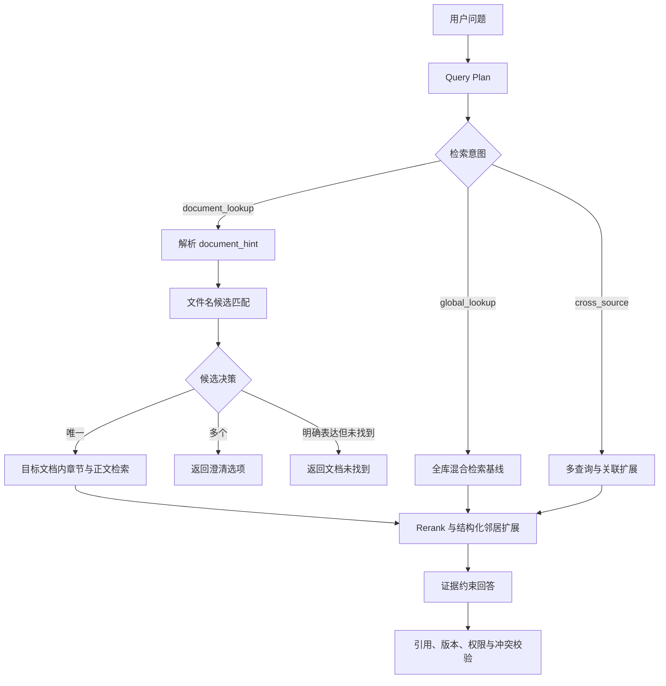

# TellerX 文档范围识别、层级检索与全库问答升级方案

> 文档状态：待评审
>
> 目标读者：产品、后端、前端、算法、测试与知识库运营人员
> 适用范围：TellerX Knowledge Chatbot 当前 PostgreSQL + pgvector + 全文检索架构

## 1. 执行摘要

TellerX 已具备文档解析、结构化切块、BM25、向量召回、Rerank、跨文档关联扩展、版本治理和服务端引用校验等基础能力。现阶段需要重点解决的不是“是否能找到相关 chunk”，而是如何准确理解用户希望在哪个范围内找答案。

实际用户通常不会输入完整文件名或完整标题路径，更常见的表达是：

- “支付平台架构里的鉴权方式是什么？”
- “帮我看看支付平台二期这份文档，接口失败怎么处理？”
- “项目 A 架构文档中，接口模块对重试次数有什么要求？”

这些问题包含一个能够匹配部分文件名的范围提示，以及一个需要在该文档内部回答的业务问题。系统应先确定目标文档，再在该文档的全部章节中进行语义检索；标题路径是系统内部提高检索准确率的结构信号，不应成为用户提问的必填项。

与此同时，用户也会直接询问“系统出现鉴权失败时应该怎么处理？”之类的全库问题。这类问题不应因为出现“系统”“接口”等常见文档词而被错误限制到某一文件中。

因此，本次升级采用两条并行、互不替代的检索路径：

1. **文档范围问答**：识别文件名片段，解析唯一目标文档，然后只在该文档内检索和回答。
2. **全库问答**：未识别出可靠文档范围时，完整保留当前全知识库混合检索能力。

核心原则是：**能确定范围时缩小范围，不能确定时绝不猜测；层级能力用于提准，不用于牺牲全库召回。**

## 2. 背景与当前能力

### 2.1 当前已有能力

当前系统已经具备以下基础：

- 支持 DOCX、XLSX、Markdown、HTML、TXT、文本型 PDF、CSV 等格式。
- Markdown、HTML 和标准 Word Heading 样式可以生成扁平的 `heading_path`。
- 文本块保留页码、工作表和单元格范围等来源信息。
- 文件名、标题和正文共同进入 PostgreSQL 全文检索文本，文件名和标题具有额外词法权重。
- 正文 chunk 使用 Qwen Embedding，并结合 PostgreSQL 全文检索执行 RRF 融合。
- 候选结果经过 Qwen Rerank，最终答案必须通过原文引用校验。
- 检索默认优先当前已批准版本，并支持项目隔离、草稿补充、版本冲突与严格拒答。
- 原始问题检索基线与 Query Plan 检索结果并行合并，规划结果不能删除基线证据。

### 2.2 当前主要缺口

当前实现中仍存在以下限制：

1. `heading_path` 是扁平字符串，数据库中没有可遍历的章节树。
2. `parent_chunk_id` 尚未形成真实的章节父子关系，主要只有前后块关系。
3. Embedding 只使用 chunk 正文，没有携带文件名、文档类型和完整标题路径。
4. 文件名、标题和正文虽然进入同一词法字段，但无法可靠区分“这是用户指定的文档范围”还是“正文中偶然出现的词”。
5. 命中文档后，现有候选扩展会读取该文档较多内容块；对于超长文档，可能引入与目标章节无关的内容。
6. Word 只稳定识别标准 Heading 样式，PDF 主要保留页码，TXT 基本没有结构。
7. 当前聊天接口只接收知识库项目范围，缺少目标文档和章节范围。
8. 前端只能选择知识库项目，不能展示系统最终解析出的目标文档，也不能处理多文档候选澄清。

### 2.3 需要避免的错误方向

本次升级不建设任意拼写纠错或不可解释的“超模糊”文档搜索。第一阶段只支持可解释的文件名片段匹配，避免因为相似名称、近义词或模型猜测把用户锁定到错误文档。

本次升级也不以层级检索替换当前全库混合检索。标题、文件名或 Query Plan 出错时，普通全库问题仍必须能够依赖原问题基线召回正确知识。

## 3. 产品目标与非目标

### 3.1 产品目标

- 用户只输入部分文件名即可在该文档内提问，不要求完整文件名或扩展名。
- 文档确定后，用户不提供标题也能搜索整份文档。
- 用户额外提供标题片段时，系统利用章节结构提高定位精度。
- 明确文档范围后，回答不得静默引用范围外文档。
- 多个文档都匹配时，系统向用户澄清而不是猜测。
- 未指定文档时，执行完整的全库混合检索。
- 层级升级不能造成全库随机问题的明显召回回退。
- 引用能够展示完整的文件名、标题路径、页码或单元格位置。

### 3.2 非目标

第一阶段不包含：

- 大范围错别字纠正、拼音纠错或语义猜测文件名。
- 依赖知识图谱作为在线检索的必需组件。
- 扫描 PDF 和复杂图片表格的完整 OCR 解决方案。
- 根据文件正文猜测一个用户没有表达过的强制文档范围。
- 在用户明确指定文档后，自动使用其他文档补齐答案。

## 4. 用户与问题场景

### 4.1 普通知识使用者

用户知道某份文档的大概名称，但不记得完整名称和章节位置。例如：

- “支付平台二期里的接口失败怎么处理？”
- “清算设计文档中超时进入哪个队列？”

成功体验：系统显示“检索范围：支付平台二期架构设计.docx”，并仅从该文档返回相关章节及引用。

### 4.2 熟悉文档结构的专业用户

用户同时知道文件名片段和章节片段。例如：

- “项目 A 架构文档的接口模块中，签名怎么定义？”

成功体验：系统先定位项目 A 的架构文档，再提高“接口模块”所在章节的排序权重。标题不完整或省略中间层级仍不影响检索正文。

### 4.3 全库随机提问用户

用户只描述业务问题，没有表达文档范围。例如：

- “系统出现鉴权失败时应该怎么处理？”
- “高金额授权需要谁审批？”

成功体验：系统在全部授权知识中查找当前有效证据，不因为“系统”“接口”“方案”等普通词误判为文件名。

### 4.4 面临多个相似文档的用户

用户提问“支付平台架构里的签名方式是什么？”，但知识库中同时存在：

- `支付平台一期架构设计.docx`
- `支付平台二期架构设计.docx`
- `海外支付平台架构设计.docx`

成功体验：如果当前知识库项目和文件名片段仍无法唯一定位，系统返回可选择的文档列表，不生成答案。

### 4.5 知识库管理员

管理员关注：

- 哪些文档没有可识别标题结构。
- 哪些文件名称过于相似，容易产生范围歧义。
- 哪些长章节被切成大量 chunk。
- 哪些文档需要重新解析或重建向量。
- 新索引是否影响原有全库问题召回。

## 5. 目标用户体验

### 5.1 文档范围问答

用户：

> 支付平台二期文档里的接口失败怎么处理？

系统内部解析：

```json
{
  "retrieval_intent": "document_lookup",
  "document_hint": "支付平台二期",
  "document_question": "接口失败怎么处理",
  "section_hints": [],
  "requested_facts": ["接口失败处理"]
}
```

系统行为：

1. 在用户选择的知识库项目内查找文件名包含“支付平台二期”的当前有效文档。
2. 唯一匹配到 `支付平台二期架构设计.docx`。
3. 仅在该文档的章节和正文中检索“接口失败怎么处理”。
4. 返回答案，并显示实际检索范围与章节来源。

### 5.2 文档范围加标题提示

用户：

> 支付平台二期的接口模块里怎么定义签名？

系统内部解析：

```json
{
  "retrieval_intent": "document_lookup",
  "document_hint": "支付平台二期",
  "document_question": "怎么定义签名",
  "section_hints": ["接口模块"],
  "requested_facts": ["签名定义"]
}
```

系统仍搜索整份目标文档，但优先召回标题路径包含“接口模块”的内容。若事实实际位于其子章节“安全设计 > 签名校验”，仍可正常命中。

### 5.3 全库问答

用户：

> 接口失败以后怎么处理？

由于问题没有可靠文件名表达，系统使用 `global_lookup`，执行全库混合检索。系统不得把“接口”误判为 `接口设计.docx` 的文档范围。

### 5.4 文档候选澄清

当存在多个接近候选时，响应不生成知识答案，而是返回：

> 找到多份可能的文档，请选择要查询的范围：
>
> 1. 支付平台一期架构设计.docx
> 2. 支付平台二期架构设计.docx
> 3. 海外支付平台架构设计.docx

用户选择后，前端在下一次请求中传入确定的 `document_id`，不需要重新依赖名称解析。

## 6. 总体架构



## 7. 查询理解设计

### 7.1 Query Plan 字段

在现有 `QueryPlan` 上新增：

| 字段 | 类型 | 说明 |
|---|---|---|
| `retrieval_intent` | enum | `document_lookup`、`global_lookup`、`cross_source`、`ambiguous` |
| `document_hint` | string/null | 用户原问题中表达的文件名片段 |
| `document_question` | string | 去除文档范围表达后的业务问题 |
| `section_hints` | string[] | 用户明确表达的章节片段，可为空 |

保留现有 `subjects`、`identifiers`、`requested_facts`、`scenario_terms`、`constraints` 和 `retrieval_queries`。

### 7.2 意图判定原则

以下表达可作为高置信度文档范围信号：

- “……文档中/文档里/这份文档里”
- “在……设计中/方案中/说明书中”
- “帮我看看……这份文件”
- 用户在高级筛选中明确选择 `document_id`

以下词语单独出现时不能视为文档范围：

- 文档
- 文件
- 方案
- 设计
- 架构
- 接口
- 系统
- 说明

模型输出的 `document_hint` 必须经过确定性文档目录验证。模型可以抽取用户表达，但不能发明文件名或文档 ID。

### 7.3 安全回退

- Query Plan 不可用时，确定性规则仅识别带明确范围语法的文档片段。
- 无法可靠提取范围时使用 `global_lookup`。
- 原问题始终保留用于追踪和全库基线检索。
- `document_question` 为空或语义不完整时使用原问题，不得提交空检索词。

## 8. 文件名片段匹配

### 8.1 标准化规则

文件名匹配使用独立字段，不使用正文内容。标准化过程包括：

1. Unicode NFKC 归一化。
2. 英文大小写统一。
3. 去除目录路径和文件扩展名。
4. 将空格、下划线、连接符和中英文括号视为可分隔符。
5. 保留版本号、期次、区域名和项目编号，因为它们通常用于消歧。
6. 删除首尾无意义标点，不删除名称内部字符。

例如：

| 原始文件名 | 标准化名称 |
|---|---|
| `支付平台二期_架构设计_V2.1.docx` | `支付平台二期 架构设计 v2.1` |
| `Payment-Gateway (APAC) Design.pdf` | `payment gateway apac design` |

### 8.2 有限匹配规则

第一阶段支持：

- 标准化完整名称匹配。
- 文件名连续子串匹配。
- 多个有效名称词全部匹配。
- 中文连续字符与双字词覆盖。
- 英文完整 token 覆盖。

第一阶段不支持：

- 任意编辑距离纠错。
- 拼音或同音字推断。
- 只凭正文主题选择目标文档。
- 将模型生成的别名直接作为硬过滤条件。

### 8.3 通用词与最低有效信息

“文档、文件、方案、设计、说明、说明书、架构、接口、系统”等通用词不能单独定位文件。范围提示至少应包含一个可区分业务实体、项目、期次、区域或产品的有效片段。

当提示过短或只有通用词时，系统应执行全库检索，或在用户明确表达文档范围时提示继续选择文档。

### 8.4 候选评分与决策

文档候选分数只由以下信号组成：

- 标准化完整名称是否匹配。
- 连续子串覆盖比例。
- 有效词覆盖比例。
- 业务项目或知识库项目是否匹配。
- 文档是否为当前有效且已批准版本。
- 用户是否显式选择该文档。

正文中出现相同词不能提高文档候选分数。

决策规则：

1. 显式 `document_id`：直接使用，但必须验证项目、权限和当前版本。
2. 唯一有效候选：解析为目标文档。
3. 多个候选且第一名覆盖明显高于第二名：选择第一名，并向用户展示完整文件名。
4. 多个候选接近：返回澄清选项，不调用答案生成模型。
5. 用户明确表达某文档但没有候选：返回文档未找到。
6. 文档范围表达不可靠：不设置硬范围，走全库检索。

分数门槛和第一、第二候选差距必须通过业务评测集校准，不在代码中散落魔法常量，应统一进入检索配置。

## 9. 文档章节模型

### 9.1 `document_sections`

新增章节表：

| 字段 | 类型 | 说明 |
|---|---|---|
| `id` | UUID | 章节主键 |
| `version_id` | UUID | 所属不可变文档版本 |
| `parent_section_id` | UUID/null | 父章节 |
| `level` | integer | 标题层级，文档根节点为 0 |
| `title` | string | 原始标题 |
| `normalized_title` | string | 标准化标题，用于检索 |
| `heading_path` | string | 兼容展示的完整路径 |
| `ordinal` | integer | 文档内稳定顺序 |
| `page_start` | integer/null | 起始页 |
| `page_end` | integer/null | 结束页 |

约束：

- `(version_id, ordinal)` 唯一。
- 父章节必须属于相同 `version_id`。
- 删除文档版本时级联删除章节。
- 每个可搜索文档版本创建一个 level 0 根章节，承载无标题正文。

### 9.2 `chunks` 调整

`chunks` 新增：

- `section_id`：所属章节。
- 保留 `heading_path`：兼容现有引用和接口。
- `parent_chunk_id`：指向同章节的首个上下文块或结构父块。
- `previous_chunk_id`、`next_chunk_id`：限定为文档顺序邻居，并在检索扩展时检查章节范围。

### 9.3 解析器输出

`ParsedUnit` 和 `TextChunk` 应携带结构化章节信息，而不只携带拼接后的标题字符串：

- 标题节点列表及层级。
- 当前章节稳定键。
- 父章节稳定键。
- 原始标题路径。
- 页码、工作表和单元格范围。

## 10. 文档解析升级

### 10.1 Markdown 与 HTML

- 按 `h1`–`h6` 或 `#`–`######` 创建章节节点。
- 层级跳跃时挂到最近有效父级，不创建虚假标题文本。
- 表格属于当前章节，并保留表格序号和结构位置。

### 10.2 DOCX

- 优先读取标准 Heading 样式和 outline level。
- 支持常见自定义标题样式映射。
- 支持 `1`、`1.1`、`一、`、`（一）` 等编号标题，但只有同时满足短段落、样式或上下文条件时才创建章节。
- 低置信度标题保留为正文，避免把普通短句误识别为章节。

### 10.3 PDF

- 优先读取 PDF 书签和可用目录信息。
- 保留页码，并识别高置信度编号标题。
- 无可靠结构时，以页面为逻辑单元并挂到文档根章节。
- 扫描 PDF 继续明确提示需要 OCR，不返回空文档成功状态。

### 10.4 TXT 与 CSV/Excel

- TXT 只识别高置信度编号标题和明显分隔结构；否则挂到文档根章节。
- Excel 以工作表为一级章节，表格区域作为其内容块。
- CSV 使用文档根章节和行范围定位。

## 11. 上下文化切块与 Embedding

### 11.1 原文与检索上下文分离

每个 chunk 保留两类文本：

- `content`：未经上下文拼接的原始正文，用于展示和引用验证。
- `embedding_input`：文件名、文档类型、完整标题路径和正文的组合，仅用于向量生成。

建议格式：

```text
Document: 支付平台二期架构设计.docx
Document type: system-design
Section: 系统架构 > 接口模块 > 异常处理
Content:
接口连续三次失败后写入 PAYMENT-RETRY 队列……
```

### 11.2 缓存与指纹

当前向量缓存按 `content_hash` 复用。升级后新增 `embedding_input_hash`，缓存键调整为：

```text
(embedding_input_hash, embedding_fingerprint)
```

这样即使多个项目文档包含相同模板正文，也会因为文件名和标题上下文不同而得到正确的检索表示。

同时升级：

- Parser fingerprint。
- Chunker fingerprint。
- Embedding preprocess version。
- PostgreSQL search schema version。

升级后必须执行全量受控重建，不能混用新旧向量空间。

## 12. 双路径检索流程

### 12.1 文档范围检索

当 `retrieval_intent=document_lookup` 且文档成功解析后：

1. 所有词法、向量和候选扩展查询都增加目标 `document_id` 硬过滤。
2. 使用 `document_question` 搜索目标文档全部 chunk。
3. `section_hints` 仅用于标题加权，不作为必需条件。
4. Rerank passage 包含完整文件名、标题路径和正文。
5. 优先扩展同章节相邻块、父章节导语和必要子章节。
6. 不再按文档开头顺序无差别加入大量 chunk。
7. 最终 Evidence 集必须全部来自目标文档。
8. 目标文档证据不足时返回 `insufficient_evidence`，不得使用其他文档补齐。

### 12.2 全库检索

当 `retrieval_intent=global_lookup` 时：

- 使用用户选择的知识库项目和权限范围。
- 完整保留原问题 BM25、Embedding、精确标识符和关联扩展。
- Query Plan 查询只增加召回通道，不能删除原问题基线候选。
- 文件名和标题作为相关性信号，不自动变成硬过滤。
- 单事实问题优先选择直接证据，避免为了多样性引入无关文档。
- 跨文档问题继续使用关联标识符和 provenance bridge 补齐来源。

### 12.3 章节扩展

结构化扩展按以下优先级执行：

1. 命中 chunk。
2. 同章节直接相邻 chunk。
3. 当前章节导语或首块。
4. 父章节中描述适用范围的短块。
5. 命中标题的必要子章节。

扩展候选仍需进入 Rerank 或确定性相关性门槛，不能仅因结构相邻直接成为最终证据。

## 13. 冲突、版本与权限规则

### 13.1 文档范围问答

- 默认只查询目标文档当前有效、已批准版本。
- 同一文档当前版本内部对同一事实给出不兼容值时返回 `conflict`。
- 草稿、历史版本和废弃版本默认不参与冲突判断。
- 用户明确询问历史或版本变化时，才检索多个版本。

### 13.2 全库问答

只有同时满足下列条件才判定真实冲突：

1. 来源描述同一业务主体。
2. 回答同一事实字段。
3. 适用地区、环境、版本、时间和业务场景相同。
4. 来源均为当前有效、已批准且用户有权限访问的版本。
5. 规范化后的关键值确实不同。

以下情况不得误报冲突：

- 不同措辞表达相同事实。
- 当前版本与历史或草稿不同。
- 不同地区、环境或业务场景采用不同值。
- 原则性文档与实现文档分别描述不同层面。
- 文档候选存在歧义但尚未确认描述同一主体；此时应澄清范围。

### 13.3 权限

- 文档候选查询必须使用与正文检索相同的 ACL 过滤。
- 澄清选项不得泄露无权访问文档的名称。
- 显式传入 `document_id` 时仍需校验其属于请求项目且用户可读。
- 来源接口和章节目录接口继续执行相同权限校验。

## 14. API 契约演进

所有新增字段均为可选，保持现有客户端兼容。

### 14.1 ChatRequest

```json
{
  "question": "支付平台二期文档里的接口失败怎么处理？",
  "conversation_id": null,
  "project_ids": ["knowledge-project-id"],
  "document_id": null,
  "document_hint": null,
  "section_path": []
}
```

- `document_id`：用户已经从候选中选择的确定文档。
- `document_hint`：可选高级调用参数；普通前端仍由服务端从问题中提取。
- `section_path`：用户显式选择的章节路径；自然语言标题提示由 Query Plan 产生。

### 14.2 ChatResponse

新增可选字段：

```json
{
  "retrieval_intent": "document_lookup",
  "resolved_document": {
    "id": "document-id",
    "filename": "支付平台二期架构设计.docx"
  },
  "resolved_scope": "支付平台二期架构设计.docx",
  "retrieval_confidence": 0.98,
  "clarification_options": []
}
```

当需要澄清时：

- `status` 使用新增的可处理状态，或由接口层返回明确的 clarification 结构。
- `answer` 只包含选择提示，不包含未经确认的业务结论。
- `clarification_options` 包含文档 ID、完整文件名、文档类型和可安全展示的所属项目。

正式实现前应决定是扩展 `AnswerStatus` 为 `clarification_required`，还是将澄清作为独立响应判别字段。推荐扩展状态枚举，使前端无需通过空答案或空来源推断。

### 14.3 CitationOut

新增：

```json
{
  "section_id": "section-id",
  "breadcrumb": ["系统架构", "接口模块", "异常处理"],
  "section_level": 3,
  "location_confidence": 1.0
}
```

保留原 `heading_path`，旧客户端可以继续显示字符串位置。

### 14.4 新增查询接口

- `GET /api/v1/documents/search?project_id=...&q=...`：文件名片段候选，仅返回用户可读文档。
- `GET /api/v1/documents/{document_id}/outline`：返回当前有效版本的章节树。

文件名候选和章节目录均不返回正文，正文继续通过受控来源接口读取。

## 15. 前端体验

### 15.1 检索范围显示

回答区域显示：

> 检索范围：支付平台二期架构设计.docx

全库问题显示：

> 检索范围：当前知识库

该信息来自服务端 `resolved_scope`，前端不得自行从用户问题猜测。

### 15.2 澄清选择

当服务端返回多个候选时，前端展示文档选择卡片。用户点击后，使用原问题与所选 `document_id` 重新提交请求。

### 15.3 来源卡片

来源卡片增加：

- 完整文件名。
- 标题面包屑。
- 页码、工作表或单元格范围。
- “查看章节上下文”入口。

### 15.4 高级筛选

高级筛选是可选能力，不改变默认自然语言入口。第一阶段可提供：

- 知识库项目。
- 具体文档。
- 章节目录。

业务项目和更复杂元数据筛选可在实际数据治理成熟后增加。

## 16. 可观测性与运营

Query Trace 增加但不限于以下信息：

- `retrieval_intent`
- 原始 `document_hint`
- 标准化文件名片段
- 候选文档 ID 与字段级分数
- 最终解析文档 ID
- 是否触发澄清
- `document_question`
- `section_hints`
- 词法、向量、结构扩展和 Rerank 候选数量
- 最终证据的文档与章节分布
- 回答状态、冲突原因和各阶段延迟

不在普通日志中记录完整文档正文、Prompt 或敏感引用。

运营指标包括：

- 文档范围识别成功率。
- 文档候选澄清率。
- 用户选择候选后的成功回答率。
- 文档未找到率。
- 文档范围外证据拦截次数。
- 全库问题 Recall 回归。
- 结构解析覆盖率和无标题长块数量。
- 新旧索引存储量与 Embedding 成本。

## 17. 测试方案

### 17.1 文档范围题集

构造至少 30 个业务项目，每个项目包含名称相似且目录一致的架构、接口、功能和运维文档。每份大型文档包含多级标题、重复章节名和模板化正文。

必须覆盖：

- 完整文件名。
- 去除扩展名的文件名。
- 连续文件名片段。
- 多个有效词组成的文件名片段。
- 文件名片段后直接询问业务问题。
- 文件名片段加部分标题。
- 多份文件同时匹配。
- 明确指定不存在的文件。
- 文档名与正文业务词相同，但实际不是目标文档。
- 相同 chunk 正文出现在不同项目文档中。
- 用户无权访问名称更匹配的文档。

验收指标：

| 指标 | 门槛 |
|---|---:|
| 唯一文件名片段正确文档 Top-1 | ≥ 98% |
| 文档内正确章节 Recall@5 | ≥ 95% |
| 已解析目标文档后的范围外证据率 | 0% |
| 多候选场景正确澄清率 | ≥ 95% |
| 不存在文档错误生成答案率 | 0% |
| 引用与章节定位准确率 | ≥ 98% |

### 17.2 全库随机题集

覆盖直接事实、流程、异常处理、比较、汇总、中英文缩写、口语、多轮指代、不可回答和真实冲突。

验收指标：

| 指标 | 门槛 |
|---|---:|
| Recall@10 相对现有固定基线 | 下降不超过 2 个百分点 |
| 无冲突问题回答准确率 | ≥ 95% |
| 一致事实误报冲突率 | ≤ 1% |
| 真实冲突识别率 | ≥ 95% |
| 无证据正确拒答率 | ≥ 95% |
| 权限越界 | 0 |
| 本地检索 P95 | ≤ 3 秒 |

### 17.3 自动化测试层级

- 单元测试：文件名标准化、范围语法、候选排序、章节树、邻居扩展和冲突规则。
- 解析测试：各格式标题结构、无标题正文、表格归属和异常文件。
- 数据库测试：迁移、约束、级联删除、ACL 与版本过滤。
- 检索集成测试：文档硬范围、全库基线、Embedding 指纹和索引重建。
- API 测试：旧请求兼容、新字段、澄清响应、目录权限和来源定位。
- 前端测试：范围展示、候选选择、重试请求和来源面包屑。
- 端到端评测：文档范围题集与全库随机题集分别执行，不用一个平均指标掩盖另一类退化。

## 18. 实施阶段

### 阶段 0：基线与观测

- 建立文档范围题集和全库随机题集。
- 固定当前索引与模型快照，记录检索和回答基线。
- 将失败归类为范围识别、文档匹配、章节召回、正文召回、Rerank、回答或引用问题。

### 阶段 1：后端核心能力

- 扩展 Query Plan。
- 实现文件名独立字段和有限片段匹配。
- 新增 `document_sections` 与 `chunks.section_id`。
- 升级解析器、结构化切块和上下文化 Embedding。
- 为搜索接口增加 `document_ids` 硬范围。
- 实现章节邻居扩展和范围外证据断言。
- 完成迁移、重建与自动化评测。

### 阶段 2：产品交互

- 在响应中返回解析范围和置信度。
- 上线多文档候选澄清。
- 展示检索范围和标题面包屑。
- 提供文件名候选与章节目录接口。

### 阶段 3：按真实失败扩展

只有业务评测证明必要时再引入：

- OCR 与复杂版式解析。
- 离线章节摘要。
- 业务项目实体和别名治理。
- 知识关系图或更复杂的跨文档推理。

## 19. 上线、迁移与回滚

1. 使用新增 Alembic 迁移创建章节表、chunk 关联字段和新版搜索投影。
2. 升级 parser、chunker、embedding preprocess 与索引 schema 指纹。
3. 保留旧数据与旧检索路径，构建新版索引。
4. 影子执行新旧检索，对比目标文档、章节、证据、回答状态和延迟。
5. 文档范围题集和全库随机题集同时通过后，小流量开启新路径。
6. 逐步扩大流量并监控澄清率、文档未找到率和全库召回。
7. 新路径异常时关闭功能开关，回到旧索引；原始文件、旧 `heading_path` 和旧 API 继续可用。

迁移期间不得让同一次向量查询混用不同 `embedding_fingerprint` 的数据。

## 20. 风险与控制

| 风险 | 影响 | 控制措施 |
|---|---|---|
| 将普通业务词误识别为文件名 | 错误缩小检索范围 | 明确范围语法、目录验证、低置信回退全库 |
| 多个模板文档名称相似 | 回答来自错误项目 | 项目过滤、候选差距门槛、用户澄清 |
| 标题解析错误 | 章节排序不准 | 标题仅提权、不作为默认硬条件；保留正文召回 |
| 上下文化向量增加存储与成本 | 重建时间和费用上升 | 新指纹、批量缓存、成本监控和分阶段重建 |
| 文档范围与全库路径互相影响 | 原有问题召回下降 | 两套独立评测门禁、原问题基线不可删除 |
| 澄清过多 | 用户体验变慢 | 使用真实问题校准候选差距，持续分析选择结果 |
| 范围外名称泄露 | 权限风险 | 候选查询、目录和正文统一执行 ACL |

## 21. 验收定义

本次升级只有同时满足以下条件才算完成：

1. 用户以部分文件名提问时，可以稳定解析到正确文档。
2. 文档确定后，全部最终证据都来自该文档。
3. 用户不提供标题时仍能在整份文档中准确定位相关内容。
4. 用户提供标题片段时，章节召回得到提升且不会成为错误硬过滤。
5. 多个文档候选接近时会澄清，不会猜测。
6. 明确文档不存在时不会从相似文档生成答案。
7. 未提供文档范围的全库问题保持原有检索能力。
8. 文档范围题集与全库随机题集分别达到验收门槛。
9. 引用继续通过数据库版本、权限和原文连续短句验证。
10. 新索引可以受控重建、切换和回滚。

## 22. 默认决策

- 用户只需提供可识别的文件名片段，不需要完整文件名。
- 文档确定后，在整份文档内执行语义检索，不要求用户提供标题。
- 标题结构用于内部提准，用户提到标题时才增加权重。
- 第一阶段不进行过度的错别字、近义名称或不透明模糊猜测。
- 明确指定文档后，答案不得静默引用其他文档。
- 未指定文档时执行完整全库检索。
- 自动推断不能替代权限、版本和原文引用校验。
- 第一阶段基于现有 PostgreSQL + pgvector + Qwen 架构演进，不新增在线图数据库依赖。
