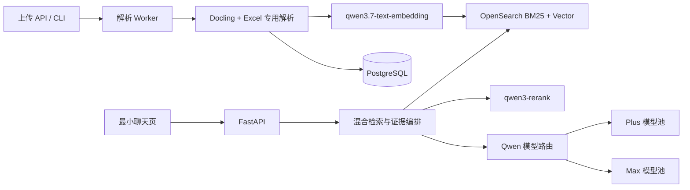

# 企业业务知识库 Chatbot 设计文档

> 本文记录当前 PostgreSQL + OpenSearch 实现。新的 PostgreSQL + Elasticsearch
> 长期维护型目标架构见
> [企业业务知识库 Chatbot 目标架构设计](postgresql-elasticsearch-knowledge-base-design.md)。

## 1. 目标与原则

本系统面向约一万份中英混合业务需求、系统设计、接口、测试和运维文档，提供可引用、可拒答、可回归评测的知识检索与问答能力。首期通过本地文件上传接入资料，后续可在不修改解析和检索核心的前提下扩展 Microsoft Graph、OneNote 与 Confluence 连接器。

准确性不依赖生成模型记忆：原始文档是事实来源，PostgreSQL 保存版本和治理元数据，OpenSearch 是可重建索引；Qwen 只处理 Embedding、候选重排和基于已选证据的回答组织。

## 2. 系统架构

Docker Compose 运行 API、Worker、PostgreSQL 和 OpenSearch。Worker 用 PostgreSQL `FOR UPDATE SKIP LOCKED` 领取任务；不引入 Redis、Kafka 或 Kubernetes。

## 3. 模型与额度

| 角色 | 默认模型 | 说明 |
|---|---|---|
| Embedding | `qwen3.7-text-embedding` / 1024维 | 中英文及缩写语义召回 |
| Rerank | `qwen3-rerank` | 对融合候选做问答相关性排序 |
| 普通回答 | `qwen3.7-plus-2026-05-26` | 单文档直接事实 |
| 复杂回答 | `qwen3.7-max-2026-05-20` | 多文档、冲突和综合问题 |

模型池定义在 `config/models.yaml`。固定快照优先、滚动别名后备、Preview 最后使用。每个生成模型初始配置 1,000,000 tokens，本地使用量达到 80% 告警线、90% 停止分配线。阿里云控制台是额度事实来源，本地统计仅用于路由。

2026-08-12 使用当前 API Key 做最小连通性验证时，`qwen3.7-max-2026-05-17` 与 `qwen3.7-max-preview` 返回 `invalid_parameter_error`，因此注册表保留这两个额度项但默认禁用；`qwen3.7-plus-2026-05-26`、`qwen3.7-plus`、`qwen3.7-max-2026-05-20` 和 `qwen3.7-max` 已验证可用。若百炼后续开放前两者，只需将对应 `enabled` 改为 `true` 并重新运行诊断。

模型路由完全由规则决定：前六个证据来自多份文档、存在版本冲突，或问题要求比较/归纳/跨系统综合时使用 Max；其他问题使用 Plus。证据不足直接拒答，不通过升级模型猜测。Plus 输出引用验证失败时可升级 Max 重试一次。

## 4. 文档管道

支持 DOCX/DOC、XLSX/XLS/XLSM、Markdown、TXT、HTML、CSV 和文本型 PDF。原生 `.one`、加密文件及扫描型 PDF 首期拒绝处理。

- Docling 优先解析 Word、PDF、HTML 和 Markdown；依赖不可用或失败时使用确定性原生解析器。
- Excel 用 `openpyxl` 同时读取公式和缓存值，保留工作表、表头、公式以及单元格范围。
- DOC/XLS 由 LibreOffice 在临时目录转换，不执行宏。
- 文本块最大约 650 tokens，普通文本保留约 60 tokens 重叠；表格按连续 25 行分组并重复表头。
- 文件 SHA-256 和 `(document_id, sha256)` 唯一约束保证重复上传幂等。
- 原始文件、数据库和索引写入分阶段执行；失败任务明确记录阶段、错误和警告，可重试。
- Embedding 每批最多十条，客户端最多重试两次。开发环境允许在 Embedding 不可用时创建 BM25-only 索引；正式验收必须开启向量召回。

上传必填项目、文档类型和生命周期。检索首先只查 `approved`；结果不足时补充 `draft` 并保留状态标识；`deprecated` 默认排除。

## 5. 检索、回答与引用

查询分别执行 CJK/英文 BM25 和 Qwen 向量召回，各取 50 条，通过 RRF 融合并为已批准文档增加稳定规则权重。前 30 条交给 `qwen3-rerank`，最终选择八条证据。

为降低对模型能力和额度的依赖，检索前还会确定性抽取精确业务编号、中文业务实体、
英文实体和缩写：编号写入 keyword 字段作强召回，名称使用短语加权。查询含精确编号时，
最终证据必须包含该完整编号；不存在的编号不能返回“最相近”文档。

Qwen 生成模型关闭思考输出与工具调用，使用低温度 JSON 输出。每项 claim 必须提供 chunk ID 和原文连续短句。服务器验证：ID 属于本次证据、引用短句真实存在、状态合法。验证失败最多重试一次；仍失败则返回 `insufficient_evidence`，不展示未经验证的结论。来源冲突返回 `conflict` 并并列展示证据。

## 6. 数据与 API

主要表包括 `projects`、`documents`、`document_versions`、`chunks`、`ingestion_jobs`、`conversations`、`messages`、`answer_feedback`、`model_usage`、`principals` 和 `document_acl`。首期文档统一为 `public`，但搜索过滤始终经过 visibility 字段，后续加入用户 principal 后无需重写索引模型。

主要接口：

- `POST /api/v1/documents`：上传文件和元数据。
- `GET /api/v1/ingestion-jobs/{id}`：查看解析和索引状态。
- `POST /api/v1/chat`：检索并生成严格引用回答。
- `GET /api/v1/sources/{chunk_id}`：查看完整证据块及定位。
- `GET /api/v1/documents/{id}/download`：下载原始来源文件。
- `POST /api/v1/feedback`：记录回答与引用反馈。
- `GET /api/v1/models/usage`：查看本地额度估算。
- `GET /health/live` 与 `/health/ready`：存活和依赖检查。

付费诊断不通过 HTTP 暴露，管理员显式执行 `qwen-diagnostics`。

## 7. 安全和运维

当前 token 通过 Docker secret 挂载，应用从 `QWEN_API_KEY_FILE` 读取。真实 token、`.env`、上传文件和 `.DS_Store` 均被 Git 忽略；日志不记录 Authorization Header、Prompt 或文档正文。IKP 部署时使用平台 Secret Manager 和持久卷覆盖本地实现。

切换 Embedding 模型或维度时创建带模型及维度后缀的新索引，重建完成后切换 alias。数据库与原始文件始终可以完整重建 OpenSearch。

## 8. 评测与发布门槛

业务人员准备 50–100 个真实问题，覆盖直接事实、跨章节综合、Excel、中英文缩写、不可回答和版本冲突。评测可通过 `python -m evaluation.business dataset.jsonl --model <snapshot>` 固定模型运行。

- 正确文档 Recall@10 ≥ 90%。
- 引用准确率 ≥ 95%。
- 无证据结论率 ≤ 2%。
- 不可回答问题正确拒答率 ≥ 90%。
- Excel 来源定位准确率 ≥ 90%。
- 本地检索 P95 ≤ 2 秒，端到端 P95 ≤ 10 秒并单列 Qwen API 延迟。

模型自评只能辅助分析，人工标注是最终验收依据。
