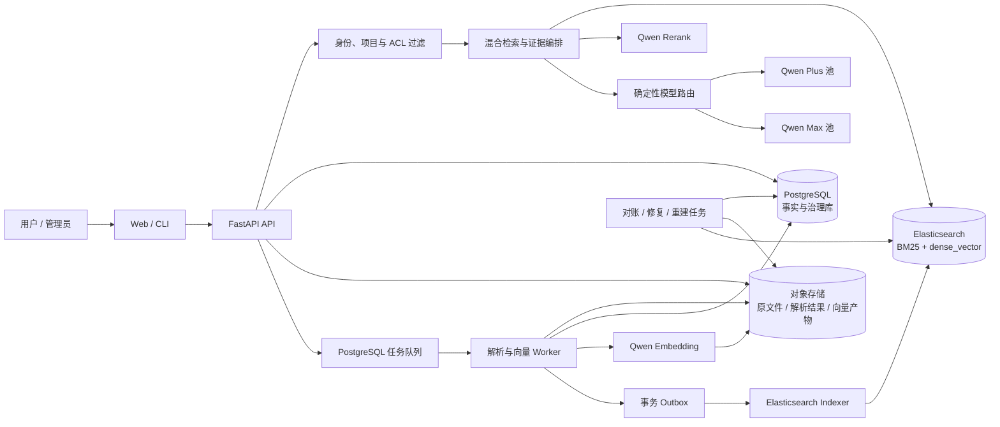
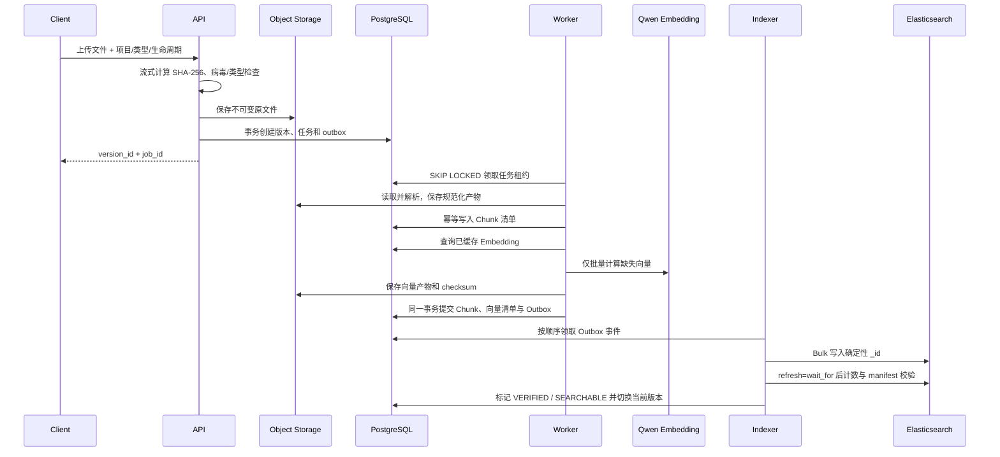

# 企业业务知识库 Chatbot 目标架构设计

> 文档状态：核心架构已实施；生产安全、监控和真实业务验收待公司环境落地  
> 技术主线：PostgreSQL + Elasticsearch + Qwen  
> 适用规模：约 10,000 份、持续增长的中英混合业务与系统文档  
> 最后更新：2026-08-13

## 1. 结论与关键决策

本方案采用“事实库、文件库、检索库”分离的持久化架构：

- PostgreSQL 是文档治理、版本、任务、权限、引用关系和索引状态的唯一事实库。
- 对象存储保存不可变原始文件、规范化解析结果和可复用的 Embedding 产物。本地使用持久卷，生产使用公司对象存储或 S3 兼容存储。
- Elasticsearch 同时承担 BM25 全文索引和 `dense_vector` 向量索引，是在线检索服务，但不是原始资料的唯一副本。
- Qwen 仅用于 Embedding、Rerank 和基于证据生成；文档状态、模型路由、拒答、引用校验和索引一致性由程序控制。
- 新文档采用增量写入；解析器、分块规则、Embedding 模型或索引映射改变时采用蓝绿重建和 alias 原子切换。
- PostgreSQL outbox、确定性文档 ID、状态机和定时对账共同保证 PostgreSQL 与 Elasticsearch 最终一致，避免“数据库已成功但索引漏写”。
- 不承诺任何问答系统达到 100% 正确。系统以可量化检索指标、严格证据门槛、可定位引用和证据不足时拒答来控制风险。

当前仓库已经完成 PostgreSQL + Elasticsearch 核心迁移，包括持久化解析产物与向量、事务 Outbox、读写 alias、版本发布、索引代际、manifest 对账修复和严格引用门禁。本文件同时描述当前实现和生产环境仍需完成的高可用、安全与业务验收要求。

## 2. 建设目标和边界

### 2.1 目标

1. 支持 Word、Excel、Markdown、HTML、文本型 PDF、Confluence 和 OneNote 导出文件持续增量接入。
2. 文档、版本、解析结果、分块、向量和索引状态均可追踪、可恢复、可重建。
3. 优先定位有效、已批准和当前版本的资料，正确处理草稿、废弃版本及冲突。
4. 同时支持中文、英文、缩写、业务编号、接口名、错误码、表格和跨文档问题。
5. 每项结论都能返回文档、版本、页码/章节或工作表/单元格范围及原文短句。
6. 在证据不足、版本冲突或权限不足时明确拒答，不使用模型常识补齐内部事实。
7. 支持无停机索引升级、定期备份、灾难恢复、回归评测和在线质量监控。

### 2.2 首期不做

- 原生 `.one` 文件解析、扫描件 OCR、音视频抽取。
- 在线 Microsoft 365、OneNote 或 Confluence 双向同步；首期接入其导出文件。
- 知识图谱、自动执行排障命令、写操作型 Agent。
- 用生成模型自动决定文档是否批准或自动解决业务版本冲突。

## 3. 总体架构



### 3.1 各存储职责

| 数据 | 权威位置 | 其他副本 | 恢复策略 |
|---|---|---|---|
| 原始文件 | 对象存储 | 可选归档库 | 开启版本控制、校验 SHA-256 |
| 文档与版本治理 | PostgreSQL | 数据库备份 | PITR + 定期全量备份 |
| 规范化解析结果 | 对象存储 | PostgreSQL 保存 URI 和摘要 | 可由原文件重新解析 |
| Chunk 正文与定位 | PostgreSQL | Elasticsearch | 可从解析结果重新切块 |
| Embedding | 对象存储持久产物 | Elasticsearch 向量字段；PostgreSQL 保存清单 | 同模型重建索引时直接复用 |
| BM25 / 向量索引 | Elasticsearch | Elasticsearch snapshot | snapshot 恢复或从事实库重建 |
| 聊天、反馈、模型用量 | PostgreSQL | 数据库备份 | PITR 恢复 |

“Elasticsearch 可重建”不等于“不备份”。生产环境仍应做 Elasticsearch snapshot，以缩短恢复时间；事实库和对象存储则保证即使 snapshot 不可用也不会丢失知识资产。

## 4. PostgreSQL 事实与治理模型

### 4.1 核心实体

| 表 | 关键字段 | 职责 |
|---|---|---|
| `projects` | `id`, `name` | 项目租户与查询范围 |
| `documents` | `project_id`, `logical_key`, `source_type`, `external_source_id`, `document_type`, `owner`, `visibility`, `is_deleted` | 稳定的逻辑文档身份 |
| `document_versions` | `document_id`, `sha256`, `version_label`, `lifecycle_status`, `technical_status`, `is_current`, `effective_at`, `effective_to`, `supersedes_version_id` | 不可变版本、生效关系和发布状态 |
| `document_artifacts` | `version_id`, `artifact_type`, `object_uri`, `sha256`, `parser_fingerprint` | 原文件、规范化 JSON、预览文件清单 |
| `chunks` | `version_id`, `ordinal`, `content`, `content_hash`, `record_hash`, `parent_chunk_id`, `page_number`, `sheet_name`, `cell_range`, `token_count` | 规范化知识单元及精确定位 |
| `embedding_models` | `model_id`, `dimensions`, `similarity`, `preprocess_version`, `fingerprint` | 向量空间定义 |
| `embedding_cache` | `content_hash`, `embedding_fingerprint`, `object_uri`, `checksum`, `dimensions` | 跨文档复用的持久向量产物 |
| `chunk_embeddings` | `chunk_id`, `embedding_fingerprint`, `cache_id` | Chunk 到持久向量缓存的关联 |
| `ingestion_jobs` | `version_id`, `stage`, `status`, `attempts`, `lease_until`, `error_message` | 可恢复的导入状态机 |
| `outbox_events` | `aggregate_id`, `event_type`, `payload`, `available_at`, `published_at`, `attempts` | 可靠驱动索引增删改 |
| `index_generations` | `physical_index`, `schema_version`, `embedding_fingerprint`, `status`, `expected_chunks`, `indexed_chunks` | 物理索引和 alias 发布记录 |
| `index_sync_state` | `version_id`, `expected_chunks`, `indexed_chunks`, `manifest_hash`, `verified_at` | PostgreSQL 与 Elasticsearch 对账 |
| `principals`, `document_acl` | 用户/组、权限 | 文档访问控制 |
| `conversations`, `messages`, `answer_feedback` | 问答和人工反馈 | 审计与质量改进 |
| `model_usage`, `query_traces` | 模型、token、延迟、候选排名、拒答原因 | 成本、诊断和可重复评测 |

### 4.2 关键约束

- `documents(project_id, logical_key)` 唯一；文件改名不产生新的逻辑文档。
- 外部连接器使用 `(project_id, source_type, external_source_id)` 唯一键和增量 cursor；上传接口由服务端生成或接受明确的 `logical_key`，不能只用文件名猜测文档身份。
- `document_versions(document_id, sha256)` 唯一；相同内容重复上传返回原版本和任务结果。
- `chunks(version_id, ordinal)` 唯一；`content_hash` 只散列规范化正文以便向量复用，`record_hash` 同时包含正文、标题路径和来源定位，用于索引 manifest 对账。
- `chunk_embeddings(chunk_id, embedding_fingerprint)` 唯一。
- 同一逻辑文档最多只有一个当前生效的 `approved` 版本；通过事务和部分唯一索引或审批服务校验保证。
- 版本发布后不可原地修改正文；修改必须创建新版本。元数据修订需记录操作者、原因和审计时间。
- 业务删除默认软删除并发出 tombstone 事件；只有满足保留策略后才允许物理清理。

### 4.3 文档状态与索引状态分离

业务生命周期：

```text
draft -> approved -> deprecated
```

技术处理状态：

```text
RECEIVED -> STORED -> PARSED -> CHUNKED -> EMBEDDED
         -> INDEXED -> VERIFIED -> SEARCHABLE
```

任何阶段失败进入 `FAILED_RETRYABLE` 或 `FAILED_FINAL`。`lifecycle_status=approved` 不代表已可搜索；只有技术状态到达 `SEARCHABLE` 才能进入线上检索。这样可避免半份文档被用户检索到。

## 5. 文档与向量的长期持久化

### 5.1 对象布局

生产环境建议采用以下不可变路径：

```text
kb/{project_id}/{document_id}/{version_id}/original/{filename}
kb/{project_id}/{document_id}/{version_id}/normalized/parser-{fingerprint}.json.zst
kb/{project_id}/{document_id}/{version_id}/preview/document.pdf
kb/embeddings/{embedding_fingerprint}/{content_hash}.f32.zst
```

- 每个对象都在 PostgreSQL 中记录 URI、长度、SHA-256、创建时间和内容类型。
- 原文件启用对象版本控制；服务端加密和保留期由公司安全策略决定。
- 本地 Docker 可用命名卷模拟，生产环境不应只依赖 API/Worker 容器文件系统。
- 解析产物使用稳定中间格式，包含段落、层级标题、表格、页码、工作表和单元格坐标，便于更换切块算法而不重新解析原文件。

### 5.2 Embedding 缓存

Embedding 缓存键定义为：

```text
SHA-256(normalized_content + embedding_model + dimensions + preprocess_version)
```

缓存向量以 float32 二进制压缩保存，PostgreSQL 保存长度和校验和。其作用是：

- 相同内容跨版本或跨文档复用向量。
- Elasticsearch 索引重建时不再次调用 Qwen。
- Worker 中断后从已完成批次继续。
- 能对向量维度、模型和预处理版本做严格隔离，禁止混用不同向量空间。

小规模部署可暂时将向量存为 PostgreSQL `bytea`，但达到数十万 Chunk 后优先使用对象存储，避免主数据库备份膨胀。PostgreSQL 始终保留向量清单和 checksum。

查询向量可按“规范化问题 + embedding fingerprint”做有上限、带 TTL 的缓存，它是性能缓存而非知识资产；文档 Chunk 向量则必须按上述方式长期保存。

## 6. 解析与结构化切块

### 6.1 支持范围

- DOCX、XLSX、XLSM、Markdown、TXT、HTML、CSV、文本型 PDF。
- DOC/XLS 经隔离的 LibreOffice 临时容器转换，不执行宏。
- Confluence 导出的 HTML/Markdown 和 OneNote 导出的 DOCX/PDF/HTML。
- 原生 `.one`、加密文件、扫描型 PDF 首期进入人工处理队列，不静默索引空内容。

### 6.2 解析质量控制

每个版本保存 `parser_name`、`parser_version`、`parser_fingerprint`、页数/工作表数、字符数、表格数、警告和失败原因。以下情况不允许自动发布：

- 解析结果为空或字符数异常下降。
- 页数、工作表数与上一版本差异超过可配置阈值。
- Excel 关键工作表、表头或合并单元格无法解析。
- 文档含密码、损坏对象或不支持的嵌入附件。

### 6.3 切块策略

- 先按标题、段落、列表、表格和分页等结构切分，再按 token 限制二次拆分。
- 文本目标 350–500 tokens，硬上限 650 tokens，重叠 50–80 tokens。
- 表格按逻辑行切块，重复表头，保存 `sheet_name`、`cell_range`、公式和显示值；不得把整张大表塞进一个 Chunk。
- 每个子块保存 `parent_chunk_id`、`previous_chunk_id` 和 `next_chunk_id`，用于命中后补充邻接上下文。
- 标题路径、项目名、文档类型不拼进正文制造伪证据，而是作为独立检索字段。
- 业务编号、错误码、接口名、缩写、文件名和表名由确定性规则抽取到 `exact_terms`。
- 分块算法具有 `chunker_fingerprint`；规则改变时建立新代际，不能覆盖旧代际后假装结果可复现。

## 7. Elasticsearch 索引设计

### 7.1 版本与部署原则

- 选择公司批准、仍受支持的 Elasticsearch 版本，并固定到精确镜像版本；Python 客户端与服务端保持兼容主版本。
- 上线前必须验证 `dense_vector`、带业务过滤的 kNN、index alias、Bulk API 和 snapshot/restore。
- 应用侧实现 RRF，避免把核心召回流程绑定到特定许可证或版本的原生 RRF 功能。
- 开发环境可以单节点；生产建议至少 3 节点、跨故障域、每个活动索引至少 1 个副本，并开启 TLS、身份认证和磁盘水位告警。

### 7.2 索引命名和 alias

```text
读 alias：  kb-chunks-read
写 alias：  kb-chunks-write
物理索引：  kb-chunks-s{schema_version}-e{embedding_fingerprint}-{generation}
示例：      kb-chunks-s3-eqwen37v1-2026081201
```

普通增量文档写入当前 write alias。只有 Mapping、分析器、Embedding 模型/维度或分块代际变化时才创建新物理索引。新索引全量回填和评测通过后，以一次 alias 操作切换读写目标；旧索引保留一个回滚窗口。

### 7.3 建议 Mapping

以下是逻辑模板，实际字段和 HNSW 参数要在固定 Elasticsearch 版本上压测后固化：

```json
{
  "settings": {
    "number_of_shards": 1,
    "number_of_replicas": 1,
    "refresh_interval": "5s",
    "analysis": {
      "normalizer": {
        "kb_keyword": {
          "type": "custom",
          "filter": ["lowercase", "asciifolding"]
        }
      }
    }
  },
  "mappings": {
    "dynamic": "strict",
    "properties": {
      "chunk_id":              {"type": "keyword"},
      "project_id":            {"type": "keyword"},
      "document_id":           {"type": "keyword"},
      "version_id":            {"type": "keyword"},
      "document_type":         {"type": "keyword"},
      "lifecycle_status":      {"type": "keyword"},
      "version_label":         {"type": "keyword"},
      "visibility":            {"type": "keyword"},
      "acl_principals":        {"type": "keyword"},
      "effective_from":        {"type": "date"},
      "effective_to":          {"type": "date"},
      "is_current":            {"type": "boolean"},
      "is_searchable":         {"type": "boolean"},
      "filename":              {"type": "text", "fields": {"raw": {"type": "keyword"}}},
      "title_path":            {"type": "text", "fields": {"raw": {"type": "keyword"}}},
      "content":               {"type": "text", "analyzer": "cjk"},
      "exact_terms":           {"type": "keyword", "normalizer": "kb_keyword"},
      "page_number":           {"type": "integer"},
      "sheet_name":            {"type": "keyword"},
      "cell_range":            {"type": "keyword"},
      "chunk_ordinal":         {"type": "integer"},
      "parent_chunk_id":       {"type": "keyword"},
      "content_hash":          {"type": "keyword"},
      "schema_version":        {"type": "keyword"},
      "embedding_fingerprint": {"type": "keyword"},
      "embedding": {
        "type": "dense_vector",
        "dims": 1024,
        "index": true,
        "similarity": "cosine"
      }
    }
  }
}
```

说明：

- 中文正文先以 Elasticsearch 内置 `cjk` analyzer 作为无插件基线，英文、编号和缩写由 `exact_terms` 与短语查询补强。若公司环境允许 ICU 或 IK 插件，只有在业务评测显著提升且版本可维护时才启用。
- ACL 必须在 BM25 和 kNN 的候选阶段同时过滤，不能等召回后再过滤，否则会减少有效结果并造成越权风险。
- `_id` 使用确定性的 `chunk_id`；物理索引名已经隔离 `embedding_fingerprint` 和
  `schema_version`，因此同一代际内重复 Bulk 写入是安全覆盖，不会混用向量空间。
- 查询只返回需要的 `_source` 字段，避免把 1024 维向量传回 API。
- `dynamic: strict` 防止错误字段静默污染 Mapping；变更必须通过模板版本发布。

### 7.4 分片和容量规划

先统计真实数据，不按“文档数”直接决定节点或分片：

```text
chunk_count = 文档数 × 每文档平均 Chunk 数
raw_vector_bytes = chunk_count × 1024 × 4
```

例如 1,000,000 个 1024 维 float32 向量的原始数值约 3.8 GiB；还需考虑 HNSW 图、倒排索引、`_source`、segment、文件系统缓存和副本，实际磁盘与内存必须通过代表性语料压测估算。建议：

- 初始索引 1 个主分片、1 个副本；达到目标数据量后，根据单分片大小、恢复时间和 P95 再调整。
- 不按项目预建大量小索引或小分片，避免 oversharding。
- Bulk 请求以响应大小和耗时压测，不能只固定文档条数；逐项检查 `errors` 和失败 item。
- 全量回填期间临时延长 refresh interval，发布前恢复并执行校验。

## 8. 增量接入与可靠索引流程

### 8.1 新文档/新版本流程



### 8.2 一致性策略

PostgreSQL 与 Elasticsearch 无法使用同一个数据库事务，因此采用“事务 outbox + 幂等消费者 + 对账”达到可靠的最终一致：

1. 文档状态变化和 `outbox_events` 在同一个 PostgreSQL 事务提交。
2. Indexer 通过 `FOR UPDATE SKIP LOCKED` 领取事件并设置租约，崩溃后可重新领取。
3. 写入 Elasticsearch 使用确定性 `_id`；重复 `index` 是安全覆盖，重复 `delete` 视为成功。
4. Bulk 成功必须逐项检查，不以 HTTP 200 代替全部成功。
5. `refresh=wait_for` 后验证目标版本 Chunk 数和 manifest hash；通过后才将版本置为 `SEARCHABLE`。
6. 每小时对账 PostgreSQL 期望数量与 Elasticsearch 实际数量；每天抽样比对 `content_hash`、状态和 ACL。
7. 对账发现缺失或过期数据自动产生修复事件，超过重试次数进入死信队列并告警。

### 8.3 版本替换

- 新版本在完成 `VERIFIED` 前，旧的已批准版本继续服务。
- 新版本审批事务先保持 `is_current=false` 并产生发布事件；Indexer 写入并验证新版本后，
  才在同一 PostgreSQL 事务释放旧版的当前槽位并设置新版 `is_current=true`，随后删除旧版索引。
- 检索默认只查当前有效 `approved`；显式历史查询才允许旧版本。
- 若同一生效范围存在两个已批准版本且无法由规则决定，回答状态必须为 `conflict`，并列出双方证据。
- 撤回或删除通过 tombstone 更新 Elasticsearch，禁止先删除 PostgreSQL 记录。

## 9. 混合检索与证据编排

### 9.1 在线检索流程

1. **鉴权与范围**：解析用户 principal、项目范围、文档类型和时间点，生成不可绕过的过滤条件。
2. **确定性查询规范化**：Unicode NFKC、全半角、大小写、空白，并保留业务编号、错误码和缩写等精确信号。
3. **语义查询规划**：由 Qwen Plus 从任意自然语言中抽取业务对象、请求属性和约束，生成最多 4 个检索子问题；只规划检索，不回答。
4. **多路 BM25 与向量召回**：原始问题和所有子问题分别执行 BM25 与向量检索，原问题始终保留。
5. **RRF 融合**：应用侧按多路候选 rank 融合，不直接混加不可比较的原始分数。
6. **主题落地门槛**：抽取出的业务对象必须真实出现在候选证据中，否则生成前直接拒答。
7. **关联扩展与规则重排**：用受控术语登记表发现别名和下游编号；默认优先 CURRENT，显式历史问题才优先 RETIRED。
8. **去重与限额**：相同 `content_hash` 去重并限制单文档占比。
9. **Qwen Rerank**：把原问题、业务对象、请求属性和约束与候选一起重排。
10. **邻接补充与证据充分性**：检查实体、条件、时间和跨文档子问题覆盖，不用近邻结果冒充证据。

### 9.2 为什么必须混合检索

- BM25 擅长精确编号、字段名、错误码和原文术语。
- 向量召回擅长同义表达、跨语言和用户未使用原文关键词的查询。
- Rerank 只处理已召回候选，无法找回前两路都漏掉的文档。
- 生成模型只能组织最终证据，不应承担检索缺失的补救责任。

### 9.3 证据门槛

阈值不能凭经验写死为一个任意相似度。应在业务评测集上按问题类型校准，并至少同时满足：

- 必要实体和限定条件被证据原文覆盖。
- 语义计划存在业务主题时，至少一个主题锚点必须在证据中落地。
- 精确编号查询的最终证据包含完整编号，而不是相近编号。
- 跨文档问题的每个子问题都有至少一个证据来源。
- 证据状态、有效日期、项目和 ACL 均合法。
- Top 结果低于标定阈值或证据互相冲突时，不生成普通 `answered`。

## 10. 回答、引用和模型路由

### 10.1 路由

使用 Plus：单文档直接事实、字段、规则、流程步骤或单个表格值。使用 Max：多文档综合、版本冲突、跨系统比较、跨工作表组合，或 Plus 在证据充分时结构化校验失败。证据不足直接拒答，不升级 Max 猜测。

模型池保持现有顺序：

- Plus：`qwen3.7-plus-2026-05-26`，然后 `qwen3.7-plus`。
- Max：`qwen3.7-max-2026-05-20`、`qwen3.7-max-2026-05-17`、`qwen3.7-max`、`qwen3.7-max-preview`。

只有诊断成功且启用的模型才进入路由；固定快照评测禁止自动切换。

### 10.2 输出契约

模型必须输出可校验 JSON：

```json
{
  "status": "answered | insufficient_evidence | conflict",
  "claims": [
    {
      "text": "结论",
      "citations": [
        {"chunk_id": "...", "quote": "证据中的连续短句"}
      ]
    }
  ]
}
```

服务器逐项验证：

- `chunk_id` 属于本次授权后的证据集。
- 引用短句经统一空白和 Unicode 规范化后仍是 Chunk 原文的连续子串。
- Chunk 对应版本仍处于允许状态和有效时间范围。
- 每个 claim 至少一个合法引用；冲突状态至少展示两个不同来源。
- 验证失败仅重试一次；再次失败返回拒答，绝不把未校验文本作为正式答案。

## 11. 准确度保障体系

准确性由五层共同控制，而不是单纯换更大的模型：

| 层级 | 机制 | 失败时动作 |
|---|---|---|
| 来源治理 | 负责人、版本、生效时间、批准/废弃、冲突规则 | 不清楚版本时标记冲突或拒答 |
| 解析切块 | 结构保留、表格坐标、解析质量门禁、抽样验收 | 不发布异常版本 |
| 召回 | BM25 + 向量 + exact terms + ACL/版本过滤 | Recall 不达标禁止发布配置 |
| 排序与证据 | RRF、Rerank、去重、覆盖检查、阈值标定 | 证据不足直接拒答 |
| 生成与引用 | 低温度结构化输出、逐 claim 引用、服务端原文校验 | 校验失败拒答 |

### 11.1 业务评测集

首批至少 100–300 个由业务人员标注的问题，持续扩展，覆盖：

- 直接事实、跨章节、跨文档、Excel 表格。
- 中文问英文资料、英文问中文资料、缩写和同义词。
- 业务编号、错误码、接口名、相似编号负例。
- 不可回答、权限隔离、草稿/废弃、版本冲突。
- 文件更新后应回答新版本、历史查询应返回指定版本。

每条标注包括期望文档版本、相关 Chunk/页码/单元格、答案要点、是否应拒答和允许的冲突状态。不能用 Qwen 自评代替人工事实标注。

### 11.2 发布门槛

建议目标如下，最终阈值应结合真实语料基线确定：

| 指标 | 首期最低门槛 | 稳定运营目标 |
|---|---:|---:|
| 正确文档 Recall@10 | ≥ 90% | ≥ 95% |
| 正确 Chunk Recall@10 | ≥ 85% | ≥ 92% |
| 引用准确率 | ≥ 95% | ≥ 98% |
| 无证据结论率 | ≤ 2% | ≤ 1% |
| 不可回答正确拒答率 | ≥ 90% | ≥ 95% |
| Excel 定位准确率 | ≥ 90% | ≥ 95% |
| 当前有效版本选择准确率 | ≥ 95% | ≥ 98% |
| 本地检索 P95 | ≤ 2 秒 | ≤ 1.5 秒 |
| 端到端 P95 | ≤ 10 秒 | ≤ 8 秒 |

任何 Mapping、分析器、Embedding、Rerank、Prompt、模型路由或阈值改变都运行同一评测集。关键指标下降超过 2 个百分点、越权结果不为零或无证据结论超标，禁止切换 alias。

### 11.3 在线反馈闭环

- 保存 query trace：规范化查询、过滤条件、索引 generation、BM25/向量候选 rank、Rerank 顺序、实际模型、Prompt 版本、引用校验结果和延迟。
- 负反馈进入人工复核队列，标注为“源文档错误、解析错误、未召回、排序错误、回答错误、权限错误”。
- 复核问题加入回归集；不得把未经审核的点赞/点踩直接作为训练数据。
- 每月报告零结果率、拒答率、冲突率、引用失败率、各检索通道贡献和 Top 失败类型。

## 12. 索引维护和升级

### 12.1 日常增量

- Worker 持续消费任务，按文档版本增量解析、Embedding 和 Bulk 索引。
- 新 Chunk 只计算缺失的 Embedding；未改变的 `content_hash` 复用缓存。
- 每个版本只有在完整验证后可搜索，不依赖 Elasticsearch 默认 refresh 时间猜测完成状态。
- 失败任务指数退避，连接错误最多两次即时重试；长期失败进入死信并人工处理。

### 12.2 全量重建

触发条件：Embedding 模型/维度改变、分析器或 Mapping 不兼容变更、Chunk 规则升级、重大数据修复。

1. 在 PostgreSQL 创建 `BUILDING` generation。
2. 创建新物理索引和模板，禁止误写旧 alias。
3. 从 PostgreSQL/对象存储流式回填；同 fingerprint 直接加载缓存向量。
4. 校验总数、每项目/版本数量、manifest hash 和随机内容样本。
5. 在新旧索引上运行相同离线评测和 shadow 查询。
6. 门槛通过后原子切换 `kb-chunks-read` 与 `kb-chunks-write` alias。
7. 观察 24–72 小时；异常时切回旧索引。
8. 超过回滚窗口且已有成功 snapshot 后，再删除旧索引。

### 12.3 定期对账

- 每小时：`SEARCHABLE` 版本 expected/indexed Chunk 数一致。
- 每日：随机抽样核对正文 hash、版本状态、ACL、embedding fingerprint。
- 每周：检测 Elasticsearch 孤儿 Chunk、PostgreSQL 无对象、对象无清单和长期卡住任务。
- 每月：做一次受控恢复演练或至少验证 snapshot repository 和最近 snapshot 可读性。

## 13. 备份、恢复与高可用

### 13.1 备份策略

| 组件 | 方案 | 建议目标 |
|---|---|---|
| PostgreSQL | 流复制/托管 HA、WAL 归档、PITR、每日全量 | RPO ≤ 5 分钟 |
| 对象存储 | 版本控制、跨故障域冗余、生命周期和删除保护 | RPO 接近 0 |
| Elasticsearch | 副本保障节点故障；SLM snapshot 到集群外仓库 | RPO ≤ 1 小时 |
| 配置与密钥 | Git 保存非密钥配置；Secret Manager 保存密钥 | 变更可审计 |

Elasticsearch 节点数据目录复制不是可靠备份；必须使用官方 snapshot/restore。副本也不是备份，因为误删和错误写入会同步到副本。

### 13.2 恢复顺序

1. 恢复 PostgreSQL 到一致时间点。
2. 验证对象存储中的原文件、规范化产物和向量 checksum。
3. 优先从 Elasticsearch snapshot 恢复以缩短 RTO；不可用时从事实库和缓存向量重建。
4. 重建 alias，执行全量计数和抽样 hash 对账。
5. 运行核心业务 smoke 评测后再开放查询和导入。

建议目标 RTO 为 4 小时，并至少每季度完成一次从备份到可查询状态的完整演练。

## 14. 安全与权限

- 生产环境接入公司 SSO，API 根据用户和组生成 `principal_ids`。
- ACL 过滤必须同时用于全文与向量查询；来源查看和原文件下载再次在 PostgreSQL 校验，不信任前端传入的 Chunk ID。
- 不使用 filtered alias 代替文档级权限；应用查询过滤与 Elasticsearch 权限共同防护。
- Elasticsearch 开启 TLS、节点认证和最小权限 API Key；API 仅有 read alias 权限，Indexer 仅有 write alias/Bulk 权限，运维任务单独授权 alias 和 snapshot。
- Qwen token、Elasticsearch 密钥和对象存储凭证由 Docker secret 或公司 Secret Manager 注入，不进入 Git、镜像、日志或异常堆栈。
- 日志默认不保存原文正文、完整 Prompt 和 Authorization Header；审计日志保存操作者、文档版本、动作和 trace ID。
- 上传执行类型白名单、大小限制、扩展名与 MIME 双检、恶意文件扫描；宏不执行。

## 15. API 与管理命令

保留现有接口并补充生命周期和索引运维接口：

| 接口 | 作用 |
|---|---|
| `POST /api/v1/documents` | 上传新文档或逻辑文档的新版本 |
| `GET /api/v1/documents/{id}/versions` | 查询版本、状态和处理结果 |
| `POST /api/v1/document-versions/{id}/approve` | 审批并发布已验证版本 |
| `POST /api/v1/document-versions/{id}/deprecate` | 废弃版本并产生索引事件 |
| `GET /api/v1/ingestion-jobs/{id}` | 查询阶段、进度、错误和重试次数 |
| `POST /api/v1/chat` | 授权后的检索、回答和严格引用 |
| `GET /api/v1/sources/{chunk_id}` | 校验权限后查看原文和定位 |
| `GET /api/v1/documents/{id}/download` | 校验权限后下载原文件 |
| `GET /api/v1/index/status` | 当前 generation、同步延迟和对账状态 |
| `POST /api/v1/admin/indexes/rebuild` | 创建蓝绿重建任务，不同步阻塞请求 |
| `POST /api/v1/admin/indexes/reconcile` | 执行或安排索引对账修复 |
| `GET /api/v1/search/explain` | 管理员诊断召回与排序，不面向普通用户 |
| `GET /api/v1/models/usage` | 查看模型本地额度估算 |

上表除 `admin/indexes/rebuild` 和 `search/explain` 外均已实现；当前全量重建通过
`knowledge-reindex` CLI 执行，Explain API 留待身份鉴权和管理员审计一起落地。

建议 CLI：

```text
knowledge-worker
knowledge-indexer
knowledge-reconcile [--repair]
knowledge-reindex --generation <id> [--resume]
python -m evaluation.business <dataset> --index-generation <id> --model <snapshot>
knowledge-backup-check
qwen-diagnostics
```

所有管理写操作应支持 dry-run、操作审计和明确的 generation/version 参数，避免对“当前索引”进行不可追踪的隐式修改。

## 16. 可观测性和告警

### 16.1 必须监控

- PostgreSQL：连接、事务错误、锁等待、数据库大小、PITR/WAL 归档状态。
- 导入：队列长度、最老任务等待时间、各阶段耗时、失败率、死信数、解析警告。
- Outbox：未发布事件数、最老事件年龄、重试数、对账差异数。
- Qwen：各模型调用成功率、429/额度/超时、token、延迟、Embedding 缓存命中率。
- Elasticsearch：cluster health、未分配 shard、JVM heap、磁盘水位、segment 数、refresh/merge、Bulk 失败、查询 P50/P95/P99。
- 质量：零结果、拒答、冲突、引用校验失败、版本选择错误、ACL 拦截和业务反馈。

### 16.2 健康检查语义

- `/health/live`：进程存活，不访问外部服务。
- `/health/ready`：PostgreSQL 可读写、读 alias 存在且 cluster 至少 yellow、配置的索引 generation 为 `ACTIVE`。
- Qwen 不作为 API 进程启动的硬依赖，但诊断失败时 readiness 返回 `degraded`，聊天接口明确告知不可用；文档上传仍可排队。
- Worker readiness 还要求对象存储可读写；Indexer readiness 还要求 write alias 可写。

## 17. 部署拓扑

### 17.1 本地开发

```text
api + worker + indexer + postgres + elasticsearch
对象存储：Docker volume（可选 MinIO，以接近生产）
Elasticsearch：single-node、0 replicas，仅开发使用
```

### 17.2 生产建议

```text
API：2+ 实例，无状态
Worker：可多实例，通过 PostgreSQL 租约并发领取解析任务
Indexer：首期单实例保证同一逻辑文档事件顺序；实现按 `document_id` 分区有序消费后再扩容
PostgreSQL：公司托管 HA + PITR
Elasticsearch：至少 3 节点，跨故障域，replica=1
对象存储：公司持久对象存储，版本控制和加密
Snapshot repository：与 Elasticsearch 节点独立的对象存储
```

不要将上传文件或向量缓存放在容器临时层；不要用单节点 Elasticsearch 或本地 bind mount 作为生产持久化承诺。

## 18. 从历史 OpenSearch 实现迁移

### 18.1 已完成的代码与基础设施变化

1. 将检索编排集中在 `Retriever`，将 Elasticsearch 索引、别名、Bulk 和查询细节封装在 `SearchIndex`。
2. `SearchIndex` 使用官方 Python `elasticsearch` 客户端，项目依赖中已移除 `opensearch-py`。
3. 配置从 `OPENSEARCH_*` 迁移为 `ELASTICSEARCH_*`，密钥通过 secret 注入。
4. Docker Compose 增加 Elasticsearch 服务与独立持久卷；生产配置启用安全和 snapshot repository。
5. Alembic 新增 artifact、embedding cache、outbox、generation、sync state 和 query trace 表。
6. 建立 index template、物理索引命名和 read/write alias。

### 18.2 数据迁移步骤

1. 冻结当前结构版本，备份 PostgreSQL、上传卷和 OpenSearch。
2. 为已有 Chunk 生成 artifact/manifest；若当前没有持久向量产物，调用 Qwen 一次补齐并保存缓存。
3. 全量回填新 Elasticsearch 物理索引，验证数量、hash、ACL 和版本状态。
4. 在不影响用户的情况下 shadow 执行新旧检索，比较 Recall、Top10 重合、延迟和拒答差异。
5. 业务评测达到门槛后，将应用读取切到 Elasticsearch。
6. 进入双写观察期，核对 outbox 和增量文档一致性。
7. 稳定后停止 OpenSearch 写入并保留只读回滚窗口；最终下线前再次备份。

迁移期间不得让同一次回答混用两个搜索后端的候选，以免评测和故障定位不可复现。

## 19. 分阶段实施与验收

### 阶段 A：持久化基础

- 建立对象存储抽象、artifact/embedding cache 数据模型和 PostgreSQL outbox。
- 验收：重复上传幂等；Worker 任意阶段中断可恢复；同内容向量不重复调用。

### 阶段 B：Elasticsearch 后端

- 实现 Mapping、read/write alias、BM25、filtered kNN、Bulk 和健康检查。
- 验收：单元/集成测试覆盖索引写入、删除、ACL、版本过滤和失败 item 重试。

### 阶段 C：检索与引用质量

- 实现 exact terms、应用侧 RRF、Qwen Rerank、证据门槛和逐 claim 引用校验。
- 验收：真实业务评测达到首期最低门槛，越权结果为 0。

### 阶段 D：长期运维

- 实现 generation、蓝绿重建、定时对账、snapshot、恢复演练和监控告警。
- 验收：新索引可无停机切换并回滚；删除/漏写可自动修复；备份恢复后通过 smoke 评测。

### 阶段 E：迁移上线

- OpenSearch 全量回填、shadow 对比、双写观察、读流量切换和旧服务下线。
- 验收：连续 7 天无严重同步差异，线上质量与延迟不低于发布门槛。

## 20. 设计决策摘要

| 决策 | 选择 | 原因 |
|---|---|---|
| 向量库 | Elasticsearch `dense_vector` | 同一引擎完成 BM25、过滤和向量召回，减少组件 |
| 事实来源 | PostgreSQL + 对象存储 | 搜索索引可损坏/升级，业务资产仍可完整恢复 |
| 向量持久化 | 对象存储 + PostgreSQL 清单 | 重建索引不重复消耗 Qwen，避免 PG 过度膨胀 |
| 同步 | Transactional outbox + 幂等 Bulk + 对账 | 跨系统无法使用单一事务，需要可恢复最终一致 |
| 检索融合 | 应用侧 RRF | 结果可解释、可测试，减少许可证与版本耦合 |
| 索引升级 | 物理 generation + alias 原子切换 | 可评测、无停机、可回滚 |
| 文档更新 | 不可变版本 + 审批发布 | 保留历史和引用可追溯性 |
| 准确度 | 评测门禁 + 严格引用 + 拒答 | 大模型无法保证绝对正确，必须可测和可控 |

## 21. 官方参考

- Elasticsearch [Vector queries](https://www.elastic.co/guide/en/elasticsearch/reference/current/vector-queries.html)：`dense_vector` 的 kNN 查询能力。
- Elasticsearch [kNN search and filtering](https://www.elastic.co/guide/en/elasticsearch/reference/8.18/knn-search.html)：候选数量、过滤和最低相似度行为。
- Elasticsearch [Aliases](https://www.elastic.co/guide/en/elasticsearch/reference/current/aliases.html)：读写 alias 和原子切换。
- Elasticsearch [Bulk API](https://www.elastic.co/guide/en/elasticsearch/reference/current/docs-bulk.html/)：批量索引、逐项错误和 refresh 行为。
- Elasticsearch [Snapshot and restore](https://www.elastic.co/guide/en/elasticsearch/reference/current/snapshot-restore.html)：受支持的集群备份与恢复方式。
- Elasticsearch [Language analyzers](https://www.elastic.co/docs/reference/text-analysis/analysis-lang-analyzer)：CJK 与可选 ICU 分析器说明。
