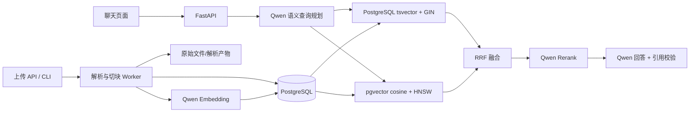

# PostgreSQL + pgvector + 全文检索知识库设计

## 1. 目标与结论

本方案移除 Elasticsearch，将事实数据、全文索引、精确业务词和向量统一维护在
PostgreSQL。Qwen 查询理解、Embedding、Rerank、回答模型、严格引用和版本治理保持不变。

适用范围：约 1 万份持续增量维护的中英文业务、需求和系统设计文档。原始文件和
PostgreSQL 是可恢复的事实来源；任何搜索行都能从 `chunks` 和持久化 Embedding 缓存重建。

## 2. 总体架构



运行组件只有：

- `api`
- `worker`
- `indexer`
- `migrate`
- `postgres`（固定 pgvector 镜像）

`indexer` 仍消费事务 Outbox，但目标变成同一个 PostgreSQL 实例中的搜索表。保留 Outbox
可以维持现有任务状态机、失败重试、发布验证和未来拆分搜索服务的能力。

## 3. 数据分层

| 数据 | 持久位置 | 恢复方式 |
|---|---|---|
| 项目、文档、版本、ACL | PostgreSQL 业务表 | PostgreSQL PITR/备份 |
| 原始文件、规范化解析产物 | 文件卷或对象存储 | 文件/对象存储备份 |
| Chunk 正文及来源坐标 | PostgreSQL `chunks` | PostgreSQL 备份 |
| Embedding 内容缓存 | 对象存储 + PostgreSQL 清单 | 缓存恢复或重新调用 Qwen |
| 在线向量 | PostgreSQL `chunk_search_index.embedding` | 从 Embedding 缓存重建 |
| 全文/精确词索引 | PostgreSQL `chunk_search_index` | 从 Chunk 本地重建 |

Embedding 缓存继续使用内容 hash 和模型 fingerprint 去重；同一内容在不同版本、文件或项目中
只调用一次 Embedding。在线向量额外进入 pgvector，保证查询不依赖本地缓存文件读取。

## 4. 搜索表

Alembic `0004_postgresql_pgvector_fts` 创建：

```sql
CREATE TABLE chunk_search_index (
    chunk_id               varchar(36) PRIMARY KEY REFERENCES chunks(id) ON DELETE CASCADE,
    embedding              vector(1024),
    embedding_fingerprint  varchar(64),
    raw_text               text NOT NULL,
    lexical_text           text NOT NULL,
    search_vector          tsvector GENERATED ALWAYS AS
                           (to_tsvector('simple', lexical_text)) STORED,
    exact_terms            text[] NOT NULL DEFAULT '{}',
    record_hash            varchar(64) NOT NULL,
    updated_at             timestamptz NOT NULL DEFAULT now()
);
```

索引：

- `search_vector`：GIN，执行 PostgreSQL 全文召回。
- `exact_terms`：GIN，保证规则编号、运行时编号和业务缩写精确命中。
- `raw_text gin_trgm_ops`：GIN，补充中文连续词、短名称和近似字符串。
- `embedding vector_cosine_ops`：HNSW，执行余弦近邻检索。
- `embedding_fingerprint`、`record_hash`：B-tree，用于向量空间过滤和对账。

## 5. 中英文词法处理

PostgreSQL 内置解析器不负责中文分词。应用在入库时执行确定性预处理：

1. NFKC 规范化并转小写。
2. 保留英文单词、数字、接口路径和完整业务编号。
3. 中文短语保留原词，同时生成重叠二元词。
4. 各字段先独立分词，再将文件名 token 写入 4 次、标题路径 token 写入 3 次，形成稳定字段权重。
5. 原始规范化文本保存在 `raw_text`，用于连续短语和 trigram 匹配。

这种处理不依赖额外 PostgreSQL 中文插件，便于公司内网部署。后续只有在业务评测证明收益时才
引入受控业务词典或专用中文分词器。

## 6. 在线检索

1. Qwen Plus 将自然语言问题提取为主题、编号、请求属性、约束和最多 4 个检索子问题。
2. 原问题和子问题分别执行全文检索与向量检索，各召回最多 50 个 Chunk。
3. SQL 查询同时过滤项目、ACL、文档软删除、生命周期和当前批准版本。
4. 全文通道对精确编号、连续主题和标题进行确定性加权。
5. 向量通道限定当前 Embedding fingerprint，使用余弦距离。
6. 服务端通过 RRF 合并两路结果并发现受控的跨文档引用编号。
7. 前 30 个候选交给 `qwen3-rerank`，保留前 8 个及必要相邻块。
8. Qwen Plus/Max 只根据证据回答；服务端验证引用 ID、原文、状态、数字和日期。
9. 主题无法在证据中落地或证据不足时直接拒答。

HNSW 查询设置 `hnsw.ef_search=200` 和 `hnsw.iterative_scan=strict_order`，降低项目、状态、ACL
过滤导致的近邻漏召回。参数必须通过真实评测集调优，不能只根据延迟调整。

## 7. 增量写入与一致性

1. Worker 在事务中写入文档版本、Chunk、Embedding 清单和 Outbox 事件。
2. Indexer 根据 Chunk ID 幂等 UPSERT 全文材料、精确词和向量。
3. Indexer 校验版本 Chunk 数量和 `(ordinal, chunk_id, record_hash)` manifest。
4. 校验通过后，才把版本设置为 `searchable` 并原子切换当前批准版本。
5. 旧批准版本标记为 `deprecated/superseded`，对应搜索行删除。
6. 定时 `knowledge-reconcile` 发现缺行、孤儿行或 hash 差异，可通过 `--repair` 重建。

虽然搜索和事实数据位于同一 PostgreSQL，Outbox 仍避免解析事务中执行大向量写入，并保留可观测
的重试边界。外部“双写最终一致”已经被简化成同库的可验证派生行。

## 8. 全量迁移

从现有 Elasticsearch 部署迁移：

1. 停止新上传，完成 PostgreSQL 和原始文件备份。
2. 将 PostgreSQL 容器镜像切换为兼容版本的 pgvector 镜像，复用原数据卷。
3. 执行 `alembic upgrade head` 安装扩展和搜索表。
4. 执行 `knowledge-reindex`，直接复用已持久化向量，不重复消耗 Qwen 额度。
5. 校验搜索行数量、manifest、缺失向量和当前批准版本。
6. 运行固定的语义、跨文档、Excel、不可回答及端到端评测。
7. 达到门槛后启动 API、Worker、Indexer；Elasticsearch 保留只读回退窗口后下线。

迁移不得删除旧 Elasticsearch 数据卷；只有 Git 备份、PostgreSQL 备份、原始文件备份和新后端
验收均完成后，才能单独安排清理。

## 9. 备份与恢复

- PostgreSQL：每日逻辑/物理备份、WAL/PITR，备份必须覆盖扩展版本清单。
- 原始文件：对象存储版本控制或独立文件归档。
- Qwen token：只进入 Secret Manager/Docker secret，不进入任何备份归档和 Git。
- 恢复后执行 `alembic upgrade head`、`knowledge-reindex`、`knowledge-reconcile`。
- HNSW、GIN 索引损坏时可以从同表数据 `REINDEX`，不需要重新解析文档。

## 10. 验收门槛

沿用现有业务验收：

- 正确文档 Recall@10 ≥ 90%。
- 引用准确率 ≥ 95%。
- 无证据结论率 ≤ 2%。
- 不可回答正确拒答率 ≥ 90%。
- Excel 来源定位准确率 ≥ 90%。
- 本地检索 P95 ≤ 2 秒。
- 迁移前后同一评测集逐题对比，不能只比较平均值。
- PostgreSQL 重启后文档、向量、全文索引和查询结果保持可用。

## 11. 已知边界

- `vector(1024)` 与当前 Qwen Embedding 维度绑定；更换维度必须新建并回填新的搜索结构。
- PostgreSQL 原生排名是 `ts_rank_cd`，不是 Elasticsearch BM25；准确度由全文 + 精确词 + 向量
  + RRF + Qwen Rerank 的整体评测决定。
- 单实例 PostgreSQL 会同时承担事务和检索负载。生产环境需独立资源配额、慢查询监控，并在增长到
  数百万 Chunk 或高并发前完成容量压测。
- 当前 HNSW 建立在全表向量上，项目/ACL 高度碎片化时可考虑项目分区或独立索引策略。
