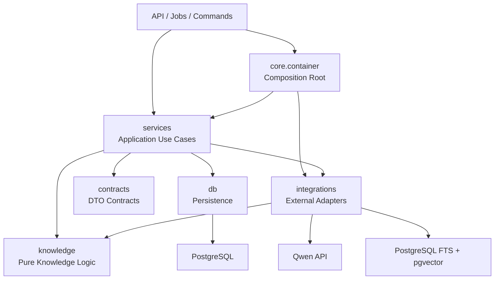

# TellerX 生产代码架构与维护约定

本文描述当前代码的真实边界、依赖方向和生产不变量。目标是让新增文档格式、检索策略、
模型供应商或 HTTP 接口时，可以定位到唯一修改区域，而不需要跨模块复制业务逻辑。

## 1. 分层与依赖方向



本项目采用务实的分层架构和依赖注入模式，而不是把所有代码强行抽象成接口。依赖方向由
`tests/test_architecture.py` 自动检查：

- `app/api/`：HTTP 参数、状态码、路由和 FastAPI 依赖，不实现检索算法。
- `app/contracts/`：跨边界 DTO，不依赖数据库、FastAPI 或外部客户端。
- `app/services/`：问答、入库、索引和模型路由用例编排。
- `app/knowledge/`：证据值对象、解析和切块等纯知识处理逻辑。
- `app/integrations/`：Qwen、PostgreSQL 检索投影与不可变对象存储适配器。
- `app/db/`：SQLAlchemy Session、ORM 模型和持久工作流记录。
- `app/core/config.py`：环境配置与启动安全校验。
- `app/core/container.py`：唯一组合根；这是允许构造并连接所有层的唯一位置。
- `app/jobs/`：常驻 Worker/Indexer 进程入口。
- `app/commands/`：诊断、评测、重建索引与基准工具，不参与在线请求。

## 2. 后端目录

```text
app/
├── api/
│   ├── router.py               公共路由树组装
│   └── routes/                 Chat、文档、运维和健康接口
├── contracts/
│   └── schemas.py              请求、响应和应用 DTO
├── services/
│   ├── answering.py            检索→路由→生成→校验→持久化
│   ├── answer_contract.py      证据 Prompt 与严格引用校验
│   ├── ingestion.py            解析、切块、Embedding、任务状态
│   ├── indexing.py             Outbox、索引发布、manifest 验证
│   ├── retrieval.py            BM25/Vector 融合、RRF 与 Rerank 策略
│   └── model_router.py         Plus/Max 路由、额度和故障切换
├── knowledge/
│   ├── evidence.py             与供应商无关的证据值对象
│   ├── parsers.py              格式解析
│   └── chunking.py             确定性文本/表格切块
├── integrations/
│   ├── qwen.py                 Qwen API 连接池和错误归一化
│   ├── search.py               PostgreSQL FTS、pgvector 与过滤适配
│   └── storage.py              内容寻址的原文件和向量存储
├── db/
│   ├── session.py              Engine、Session 和 Base
│   └── models.py               PostgreSQL ORM 模型
├── core/
│   ├── config.py               配置与生产安全约束
│   └── container.py            ApplicationContainer 组合根
├── jobs/                        Ingestion Worker 与 Indexer
├── commands/
│   ├── diagnostics.py          Qwen 连接诊断
│   └── reindex.py              检索投影重建与切换
└── main.py                      ASGI 启动与资源释放
```

`app/` 根目录只允许保留 `main.py` 和包声明。新增实现必须进入职责明确的子包。
评测、Benchmark 和 Smoke 工具统一位于顶层 `evaluation/`，不进入生产镜像。依赖方向只能是
`evaluation -> app`；`app` 不得导入 `evaluation` 或 `tests`。生产模块也不能反向导入
`commands` 或 `jobs`。

## 2.1 质量保障目录

```text
evaluation/
├── benchmark/                  合成语料、离线替身、加载和评测
├── datasets/                   固定业务题集与语义理解用例
├── smoke/                      PostgreSQL FTS 与 pgvector 验证
├── scripts/                    语料生成和一键质量门禁
└── reports/                    历史验证结果
```

## 3. 前端目录

```text
frontend/src/
├── main.jsx          React 挂载入口
├── App.jsx           页面状态和问答用例编排
├── api.js            HTTP 访问和错误归一化
├── storage.js        版本化的浏览器本地持久化
├── components.jsx    无业务网络调用的 UI 组件
└── styles.css        视觉样式
```

新增接口调用只能放在 `api.js`；组件不直接调用 `fetch`。会话服务端 ID 与本地显示会话 ID
分开保存，避免刷新页面后覆盖服务端对话。

## 4. 文档入库不变量

1. 上传 API 先将原文件写入按 SHA-256 寻址的持久存储。
2. PostgreSQL 保存逻辑文档、不可变版本和入库任务。
3. Worker 使用 `FOR UPDATE SKIP LOCKED` 与租约领取任务，可安全水平扩展。
4. Parser 输出携带页码、标题路径、工作表和单元格范围的逻辑单元。
5. Chunk ID、内容 hash 和 record hash 必须确定性生成，保证重试幂等。
6. Embedding 同时写 PostgreSQL 元数据和不可变对象文件，重建索引时优先复用。
7. Worker 只提交 Outbox；Indexer 在同一 PostgreSQL 中发布检索投影并核验 chunk manifest。
8. 新批准版本完全可检索后才切换 `is_current`，旧版本不会提前消失。

## 5. 回答安全不变量

1. Retriever 只返回满足项目、生命周期、版本和 ACL 条件的证据。
2. 没有候选证据时不调用生成模型，直接拒答。
3. Qwen 只能看到选中的证据块，不能使用联网搜索或外部工具。
4. 每个结论必须包含已知 Chunk ID 和该 Chunk 内连续存在的原文短句。
5. 服务端从通过校验的 claims 重建最终答案，不返回模型未引用的顶层自由文本。
6. 返回前再次在 PostgreSQL 核验证据仍为可检索版本，避免版本切换竞态。
7. 冲突回答至少需要两条来源；证据不足不会通过升级 Max 来猜测。
8. 复杂问题优先 Max；只有所有 Max 均不可用、非固定模型评测且证据充分时，才允许一次
   Plus 受控降级。实际档位和模型必须写入响应与查询轨迹。

## 6. 配置与资源生命周期

- `Settings` 在进程启动时校验切块、召回数量、缓存和生产模式安全约束。
- `APP_ENV=production` 时禁止 BM25-only 降级、内联入库和通配 CORS。
- `ApplicationContainer` 是唯一对象组合根；API、Worker、Indexer 各自拥有进程内实例。
- Qwen 使用长连接池，PostgreSQL 检索适配器使用 SQLAlchemy 连接池；SIGTERM 后显式关闭。
- 凭证只从只读 secret 文件加载，异常和日志不得包含 token。
- Docker 的 `runtime` 目标供 API、迁移和 Indexer 使用；仅 `worker-runtime` 安装
  LibreOffice Writer/Calc，以隔离旧 `.doc/.xls` 转换依赖和安全补丁面。
- Python 直接依赖在 `pyproject.toml` 固定版本；升级框架或解析器时必须同步回归。

## 7. 修改规则

- 新文档格式：修改 `app/knowledge/parsers.py` 并补解析、来源定位和入库持久化测试。
- 新检索算法：修改 `app/services/retrieval.py`；PostgreSQL SQL/索引变更才修改
  `app/integrations/search.py`，并同步补 Recall、精确标识符和项目过滤测试。
- 新模型或供应商：在 `app/integrations/` 实现独立适配器，通过组合根注入。
- 新 HTTP 接口：放入 `app/api/routes/`；跨接口业务规则应先提取到 `app/services/`。
- 变更 Embedding 模型、维度或预处理：提升 fingerprint 并通过新物理索引原子切换。
- 变更回答 JSON：同步修改 `app/contracts/schemas.py`、`app/services/answer_contract.py`、
  Prompt 版本和回归评测基线。

## 8. 必须通过的提交门禁

```bash
.venv/bin/ruff check app evaluation tests
.venv/bin/pytest -q
npm run build
docker compose config --quiet
docker compose build
curl -f http://localhost:8000/health/ready
curl -f http://localhost:8000/api/v1/index/status
```

涉及检索、Embedding、Rerank、回答契约或版本治理的改动，还必须使用固定语料运行离线检索
回归和至少一轮真实 Qwen 问答抽查；人工标注仍是最终效果依据。
