# TellerX 系统处理流程说明

本文档整理 TellerX 当前代码中两条最核心的业务链路：

1. 用户问题如何经过查询理解、混合检索、模型生成、引用校验，最终形成回答。
2. 原始文档如何经过上传、解析、切块、向量化、事实落库和搜索投影发布，最终变成可检索知识。

文档描述以当前 `codex/postgresql-pgvector-fts` 分支代码为准。

## 1. 架构边界

系统把数据分为“权威事实”和“可重建投影”：

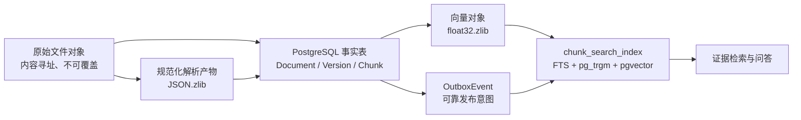

- 原始文件、文档版本和 Chunk 是权威数据。
- `chunk_search_index` 是搜索投影，可以从事实表和向量对象重新生成。
- 上传接口只负责安全接收文件和创建任务，不直接在请求线程中完成整条索引链路。
- 问答服务不会直接返回模型自由文本，而是返回通过服务端引用校验的声明。

在线请求统一遵循类似 Spring MVC 的职责链：

```text
Controller（HTTP）
  → Application Service（用例编排）
    → Domain/Business Service（业务规则）
    → Repository（数据库读写）
    → Integration（Qwen、对象存储和搜索适配器）
```

---

## 2. 用户问题处理流程

### 2.1 完整主流程

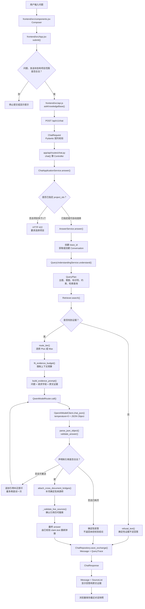

### 2.2 查询理解

入口：[`QueryUnderstandingService.understand()`](../app/services/query_understanding.py)

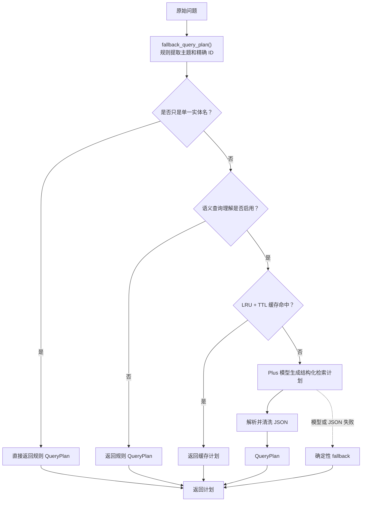

重要约束：

- 企业内部 ID 只从原始问题提取，不接受模型虚构的标识符。
- 最多生成 4 条独立检索查询。
- 主题、操作场景、请求字段和约束会重新分类。
- 查询理解失败不会直接导致问答失败，而是退回规则计划。

### 2.3 混合检索

入口：[`Retriever.search()`](../app/services/retrieval.py)

默认配置：

| 参数 | 默认值 | 作用 |
|---|---:|---|
| `retrieval_top_k` | 50 | 每个初始召回通道的候选上限 |
| `rerank_candidates` | 30 | 送入重排器的候选上限 |
| `evidence_top_k` | 8 | 核心证据数量 |
| `vector_min_similarity` | 0.25 | 向量最低相似度 |

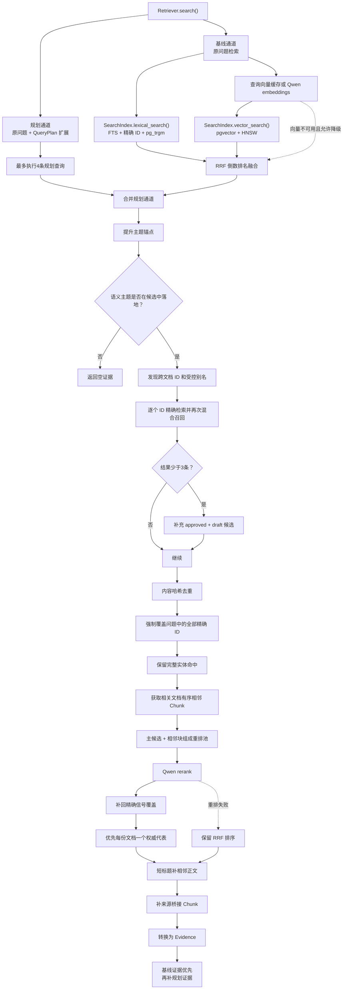

所有检索都会过滤：

- `Document.is_deleted = false`；
- `DocumentVersion.technical_status = searchable`；
- `approved` 只接受 `is_current = true`；
- 指定项目范围；
- 当前聊天入口未传入 `principal_ids`，所以只搜索 `visibility = public` 的文档。

### 2.4 模型路由和生成

入口：[`QwenModelRouter.call()`](../app/services/model_router.py)

- 同一文档出现多个版本、证据跨多个文档，或者问题包含比较、差异、综合等复杂标记时，选择 Max。
- 其他问题选择 Plus。
- 本地配额使用率达到 80% 时告警，达到 90% 时停止向该模型派发。
- 未固定模型时，同层候选按优先级故障转移。
- 固定模型用于可重复评测，失败时不跨模型降级。
- Max 完全不可用时，非固定模型请求允许一次受证据约束的 Plus 降级。
- 每次调用都写入 `ModelUsage`。

### 2.5 引用校验与最终结论

入口：[`validate_answer()`](../app/services/answer_contract.py)

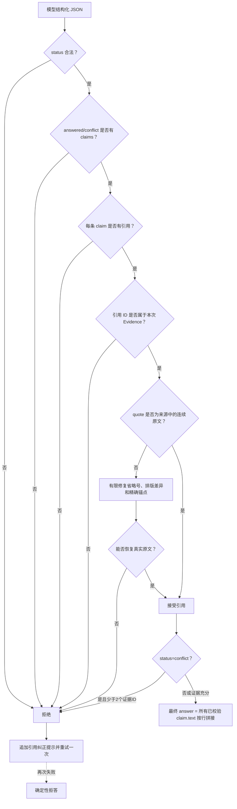

最终回答的关键实现是：

```python
answer = "\n".join(claim.text for claim in claims)
```

模型原始输出中的顶层 `answer` 不会直接作为事实答案返回。

### 2.6 问答落库

[`AnswerService._persist()`](../app/services/answering.py) 组装审计数据后，委托
[`ChatRepository.save_exchange()`](../app/repositories/chat.py) 在同一事务中保存：

- 用户 `Message`；
- 助手 `Message`、回答状态、模型 ID 和引用；
- `QueryTrace`：规范化问题、项目范围、查询计划、搜索索引名、证据 ID、分数、路由层级和延迟。

当前 `conversation_id` 主要用于消息分组。现有代码没有把历史消息加载进下一轮提示词，因此每个问题仍按独立问题重新理解和检索。

---

## 3. 原始文档入库流程

### 3.1 完整主流程

```mermaid
flowchart TD
    U["用户上传原始文件"] --> API["documents.py<br/>upload_document() 薄 Controller"]
    API --> APP["DocumentApplicationService.upload()"]
    APP --> VALIDATE{"生命周期和扩展名是否合法？"}
    VALIDATE -- 否 --> ERROR["HTTP 4xx"]
    VALIDATE -- 是 --> SAVE["LocalObjectStorage.save()"]
    SAVE --> STREAM["按1MB流式读取<br/>限制大小 + SHA-256"]
    STREAM --> OBJECT["原始文件内容寻址存储"]

    OBJECT --> PROJECT["DocumentRepository<br/>查询或创建 Project"]
    PROJECT --> DOCUMENT["按 project + logical_key<br/>查询或创建 Document"]
    DOCUMENT --> DUP{"同一 Document 下<br/>SHA-256 是否重复？"}
    DUP -- 是 --> EXISTING["复用 DocumentVersion<br/>必要时创建新重试任务"]
    DUP -- 否 --> VERSION["创建 DocumentVersion<br/>technical_status=received"]
    VERSION --> JOB["创建 IngestionJob<br/>queued"]
    JOB --> ACCEPT["提交事务并返回 202"]

    ACCEPT --> WORKER["ingestion_worker.py"]
    WORKER --> CLAIM["claim_next_job()<br/>SKIP LOCKED + 15分钟租约"]
    CLAIM --> PROCESS["IngestionService.process()"]
    PROCESS --> PARSE["DocumentParser.parse()<br/>ParsedUnit"]
    PARSE --> CHUNK["chunk_units()<br/>TextChunk"]
    CHUNK --> ARTIFACT["保存 normalized JSON.zlib<br/>DocumentArtifact"]
    ARTIFACT --> EMBEDDING["向量缓存查询或批量生成"]
    EMBEDDING --> FACTS["写 Chunk + ChunkEmbedding"]
    FACTS --> OUTBOX["同一事务写 OutboxEvent"]
    OUTBOX --> INDEXPENDING["Version / Job = index_pending"]

    INDEXPENDING --> INDEXWORKER["index_worker.py"]
    INDEXWORKER --> PUBLISH["IndexingService.publish_event()"]
    PUBLISH --> ROWS["组装搜索记录并加载向量对象"]
    ROWS --> UPSERT["UPSERT chunk_search_index"]
    UPSERT --> VERIFY["校验投影数量并记录同步状态"]
    VERIFY --> CUTOVER["批准版本原子切换 current<br/>旧版本 superseded"]
    CUTOVER --> SUCCESS["technical_status=searchable<br/>Job=complete 100%"]
```

### 3.2 原始文件与文档身份

应用入口：[`DocumentApplicationService.upload()`](../app/application/document_service.py)

HTTP Controller [`upload_document()`](../app/api/routes/documents.py) 只把表单转换为
`UploadDocumentCommand`，不直接执行 SQLAlchemy 查询或文档生命周期规则。

原始文件由 [`LocalObjectStorage.save()`](../app/integrations/storage.py) 保存：

```text
{storage_root}/{sha前2位}/{sha第3-4位}/{完整sha}-{安全文件名}
```

处理规则：

1. 清理目录和危险文件名字符。
2. 每次读取 1MB，默认最大 100MB。
3. 写临时文件的同时计算 SHA-256。
4. 使用硬链接以“存在则不覆盖”的方式原子提交。
5. `DocumentVersion.storage_path` 只保存相对路径。

文档身份层级：

```text
Project
└── Document                 project_id + logical_key 唯一
    ├── DocumentVersion v1   document_id + sha256 唯一
    └── DocumentVersion v2
```

- `Document` 是稳定的逻辑身份。
- `DocumentVersion` 是不可变文件内容。
- 没有显式 `logical_key` 时默认使用文件名。
- 重复内容不会创建第二个版本。
- 失败重试创建新的 `IngestionJob`，不改写旧任务历史。
- 上传时声明为 `approved` 的版本仍然以 `is_current=false` 创建，必须等索引发布完成后才能切换为当前版本。

### 3.3 Worker 租约

[`IngestionService.claim_next_job()`](../app/services/ingestion.py) 使用：

```sql
status = 'queued'
OR (status = 'running' AND lease_until < now())
FOR UPDATE SKIP LOCKED
LIMIT 1
```

- 多个 Worker 可以并发运行。
- Worker 会跳过其他 Worker 已锁定的任务。
- 进程崩溃后，租约过期任务可以重新领取。
- 入库任务租约为 15 分钟。

### 3.4 格式解析

入口：[`DocumentParser.parse()`](../app/knowledge/parsers.py)

| 格式 | 解析行为 | 保存的来源位置 |
|---|---|---|
| DOCX | 按原始段落/表格顺序；识别 Heading；表格单独成单元 | 标题路径、表格编号 |
| PDF | 每页一个逻辑单元；修复视觉换行拆开的 ASCII ID | 页码、`Page N` |
| Markdown | 按 `#` 标题层级切分 | 完整标题路径 |
| HTML | 删除脚本和样式；保留标题、段落、列表、引用、表格 | 标题路径 |
| XLSX/XLSM | 忽略隐藏 Sheet；读取公式和缓存值；每25行一组 | Sheet 名、单元格范围 |
| CSV | 每25行一组，后续组重复表头 | 行范围 |
| DOC/XLS | LibreOffice 临时转换后复用现代解析器 | 转换 warning |
| TXT | 整份文本形成初始单元 | 无额外定位 |

扫描版 PDF 当前没有 OCR；无法提取文字时任务失败。

统一输出结构：

```python
ParsedUnit(
    text=...,
    heading_path=...,
    page_number=...,
    sheet_name=...,
    cell_range=...,
    is_table=...,
)
```

### 3.5 切块

入口：[`chunk_units()`](../app/knowledge/chunking.py)

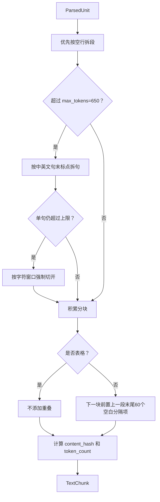

默认参数：

```text
target_tokens  = 450
max_tokens     = 650
overlap_tokens = 60
```

当前实现会 `del target_tokens`，所以实际切块主要由解析器结构和 `max_tokens` 控制；`target_tokens` 目前只进入 `chunker_fingerprint`。

- `content_hash` 只根据正文计算，用于向量复用和内容去重。
- `record_hash` 根据正文和来源位置计算，用于搜索投影漂移检查。

### 3.6 规范化产物

[`IngestionService._save_normalized_artifact()`](../app/services/ingestion.py) 保存：

```text
artifacts/{document_id}/{version_id}/normalized-{parser_fingerprint}.json.zlib
```

内容包括：

```json
{
  "schema_version": 1,
  "parser_fingerprint": "native-v3",
  "warnings": [],
  "units": []
}
```

数据库 `document_artifacts` 表保存对象 URI、哈希、字节数和解析器指纹。

### 3.7 向量缓存

入口：[`IngestionService._embeddings()`](../app/services/ingestion.py)

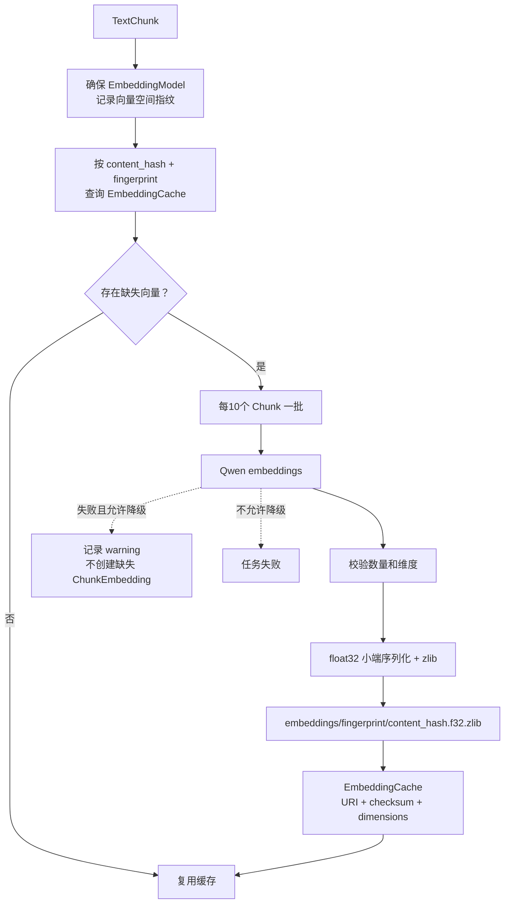

向量本体保存在对象存储，`embedding_cache` 保存元数据，`chunk_embeddings` 把 Chunk 关联到缓存。相同内容出现在多份文档中时可以共享一份向量。

### 3.8 Chunk 和 Outbox 原子提交

入口：[`IngestionService._persist_chunks_and_event()`](../app/services/ingestion.py)

- 重试时先删除该版本旧的 `ChunkEmbedding` 和 `Chunk`。
- Chunk ID 使用固定命名空间的 UUID5：`version_id + ordinal + content_hash`。
- 写入 `previous_chunk_id` 和 `next_chunk_id`。
- 先 `flush()` Chunk，再写入 `ChunkEmbedding`。
- 同一事务中创建 `OutboxEvent`。
- 同一事务把版本和任务推进到 `index_pending`。

因此不会出现“Chunk 已提交，但索引发布通知丢失”的状态。

### 3.9 搜索投影发布

入口：[`IndexingService.publish_event()`](../app/services/indexing.py)

Index Worker：

- 使用 `FOR UPDATE SKIP LOCKED` 领取 Outbox 事件；
- 使用 5 分钟租约；
- 启动时回收过期租约；
- 发布失败时指数退避；
- 第 5 次仍失败时进入 `dead`；
- 定期执行 `reconcile(repair=True)`。

`_documents_for_version()` 会从事实表读取 Chunk，并从对象存储加载向量，同时校验 checksum 和 dimensions。

[`SearchIndex.index_chunks()`](../app/integrations/search.py) 生成：

```text
raw_text     = 文件名 + 标题 + 正文
lexical_text = 文件名 Token x4 + 标题 Token x3 + 正文 Token x1
exact_terms  = 精确业务 ID + Acronym
embedding    = vector(1024)
```

并 UPSERT 到 `chunk_search_index`。数据库迁移同时建立：

- `search_vector` GIN 全文索引；
- `exact_terms` GIN 索引；
- `raw_text` trigram GIN 索引；
- `embedding` HNSW 向量索引。

### 3.10 版本发布和校验

[`IndexingService._publish_version()`](../app/services/indexing.py) 执行：

1. 写入新版本全部搜索记录。
2. 删除该版本不再存在的陈旧投影。
3. 比较实际投影数量与预期 Chunk 数量。
4. 写入 `IndexSyncState`。
5. 如果是 approved 版本，先释放旧 current 版本的唯一位置。
6. 旧版本变为 `deprecated/superseded`。
7. 新版本变为 `searchable/current`。
8. 删除旧版本搜索投影。
9. 任务变为 `succeeded/complete/100%`。

发布当下直接校验投影数量；定时 `reconcile()` 会进一步比较 `ordinal + chunk_id + record_hash` 清单，发现漂移时触发重建。

---

## 4. 状态机

### 4.1 DocumentVersion 技术状态

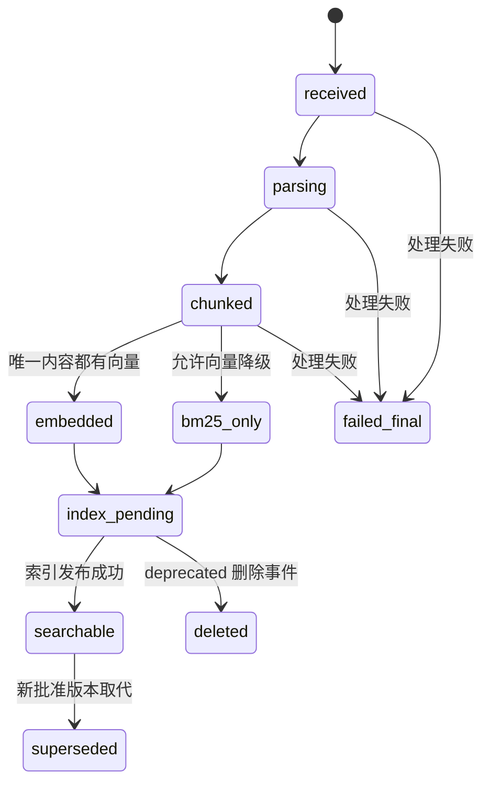

### 4.2 IngestionJob

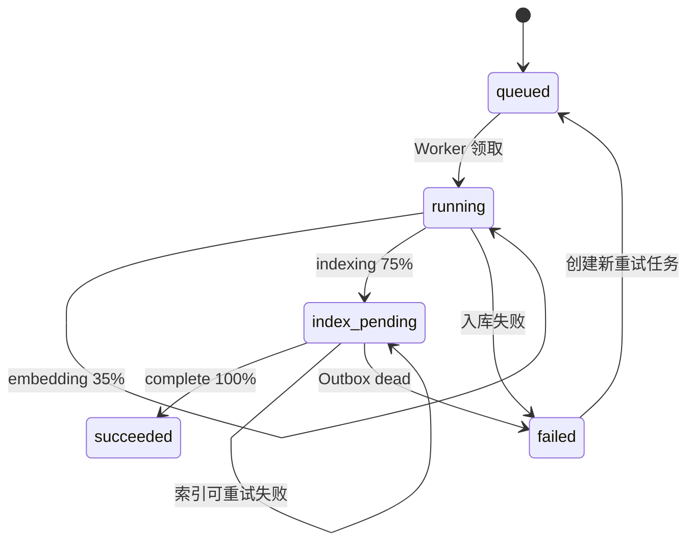

### 4.3 OutboxEvent

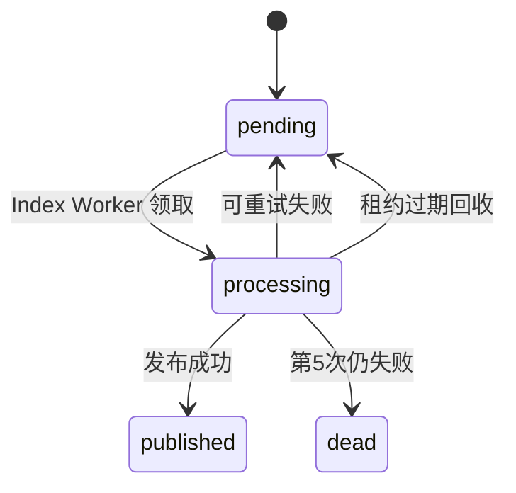

---

## 5. 最终数据位置

| 数据 | 位置 | 类型 | 是否可重建 |
|---|---|---|---:|
| 原始文件 | `storage_root/{sha...}-{filename}` | 权威对象 | 否 |
| 文档身份 | `documents` | 权威事实 | 否 |
| 文件版本 | `document_versions` | 权威事实 | 否 |
| 入库任务历史 | `ingestion_jobs` | 工作流审计 | 否 |
| 规范化解析单元 | JSON.zlib + `document_artifacts` | 中间产物 | 可从原文件重做 |
| 文本分块和来源位置 | `chunks` | 权威事实 | 可从解析产物重做 |
| 向量空间 | `embedding_models` | 元数据 | 可重新登记 |
| 压缩向量 | `.f32.zlib` | 派生产物 | 可重新生成 |
| 向量缓存索引 | `embedding_cache` | 派生元数据 | 可重新生成 |
| Chunk 向量关联 | `chunk_embeddings` | 派生关系 | 可重新生成 |
| 发布事件 | `outbox_events` | 可靠工作流记录 | 不应随意删除 |
| 搜索投影 | `chunk_search_index` | 派生投影 | 可以重建 |
| 版本同步状态 | `index_sync_state` | 一致性审计 | 可以重新计算 |
| 问答消息 | `messages` | 问答记录 | 否 |
| 查询追踪 | `query_traces` | 问答审计 | 否 |

---

## 6. 核心文件索引

| 文件 | 主要职责 |
|---|---|
| [`frontend/src/App.jsx`](../frontend/src/App.jsx) | 前端问题提交、回答状态和本地会话快照 |
| [`frontend/src/api.js`](../frontend/src/api.js) | 浏览器 HTTP 适配器 |
| [`app/api/routes/chat.py`](../app/api/routes/chat.py) | 问答与反馈的薄 HTTP Controller |
| [`app/application/chat_service.py`](../app/application/chat_service.py) | 项目范围判断和问答/反馈用例编排 |
| [`app/repositories/chat.py`](../app/repositories/chat.py) | 会话、消息、追踪和反馈数据库读写 |
| [`app/services/answering.py`](../app/services/answering.py) | 查询准备、生成重试、实时引用检查和响应编排 |
| [`app/services/query_understanding.py`](../app/services/query_understanding.py) | 语义查询计划和规则降级 |
| [`app/services/retrieval.py`](../app/services/retrieval.py) | 混合召回、扩展、重排和证据整形 |
| [`app/services/answer_contract.py`](../app/services/answer_contract.py) | Prompt、证据预算和引用校验 |
| [`app/services/model_router.py`](../app/services/model_router.py) | Plus/Max 路由、配额和故障转移 |
| [`app/api/routes/documents.py`](../app/api/routes/documents.py) | 文档接口参数与文件响应的薄 Controller |
| [`app/application/document_service.py`](../app/application/document_service.py) | 上传、版本、审批、废弃和下载用例 |
| [`app/repositories/documents.py`](../app/repositories/documents.py) | 文档聚合、任务、版本和 Outbox 数据访问 |
| [`app/application/operations_service.py`](../app/application/operations_service.py) | 就绪状态、用量和索引维护用例 |
| [`app/repositories/operations.py`](../app/repositories/operations.py) | 运维状态所需的数据库聚合查询 |
| [`app/integrations/storage.py`](../app/integrations/storage.py) | 原始文件、解析产物和向量对象存储 |
| [`app/knowledge/parsers.py`](../app/knowledge/parsers.py) | 格式感知的文档解析 |
| [`app/knowledge/chunking.py`](../app/knowledge/chunking.py) | 文本和表格切块 |
| [`app/services/ingestion.py`](../app/services/ingestion.py) | 入库任务、向量缓存、Chunk 和 Outbox |
| [`app/jobs/ingestion_worker.py`](../app/jobs/ingestion_worker.py) | 入库 Worker 入口 |
| [`app/services/indexing.py`](../app/services/indexing.py) | 搜索投影发布、验证、版本切换和修复 |
| [`app/jobs/index_worker.py`](../app/jobs/index_worker.py) | Outbox/索引 Worker 入口 |
| [`app/integrations/search.py`](../app/integrations/search.py) | PostgreSQL FTS、pg_trgm 和 pgvector 适配器 |
| [`app/db/models.py`](../app/db/models.py) | ORM 事实表、工作流和审计模型 |
| [`alembic/versions/0004_postgresql_pgvector_fts.py`](../alembic/versions/0004_postgresql_pgvector_fts.py) | 搜索投影表及数据库索引迁移 |
